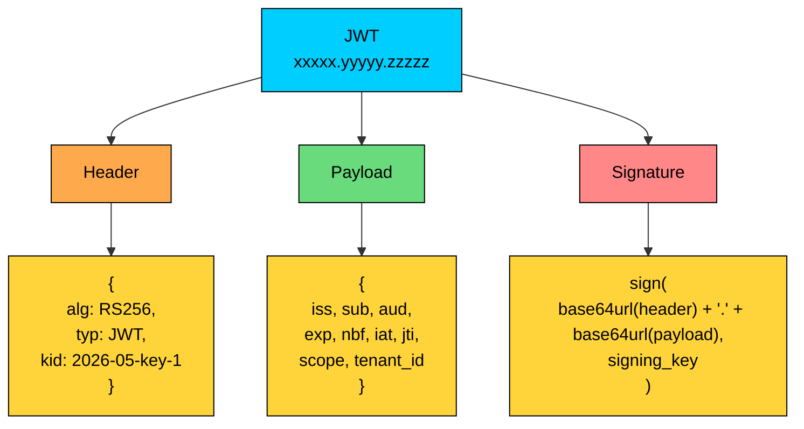
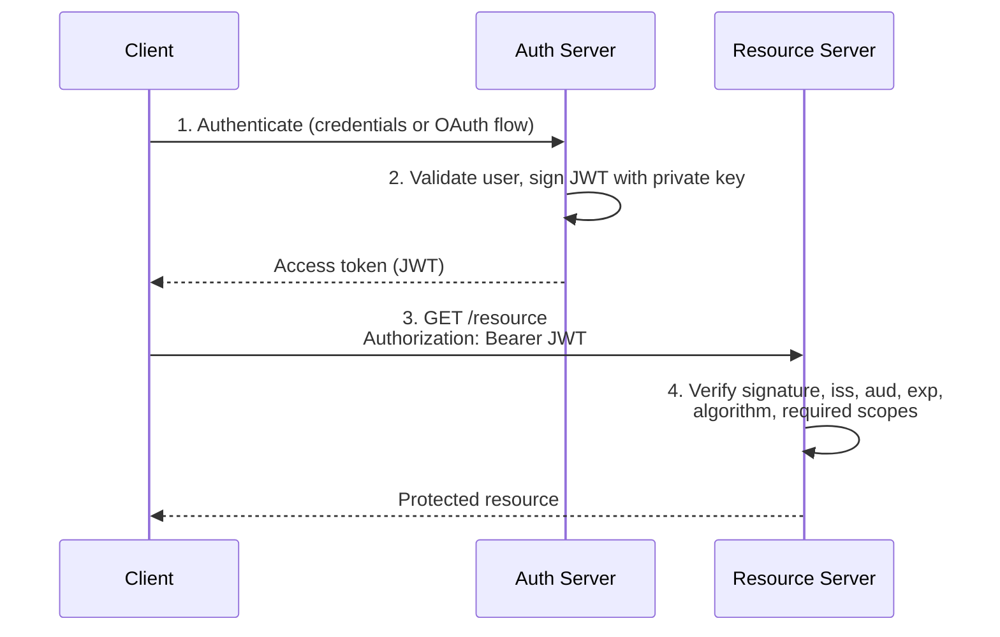

import React from 'react';
import CodeBlock from '../../../../components/ui/CodeBlock';
import Callout from '../../../../components/ui/Callout';

<div className="article-header">
  <div className="breadcrumb">
    <a href="/">Curated Notes</a>
    <span className="breadcrumb-separator">›</span>
    <span className="breadcrumb-current">JWT</span>
  </div>
  <h1>JWT</h1>
  <p style={{ color: 'var(--text-muted)', fontSize: '1.1rem', marginBottom: '16px', lineHeight: '1.6' }}>
    Master the essentials of JWT in this curated guide.
  </p>
  <div className="meta-info">
    <span className="meta-item">
      <svg width="14" height="14" viewBox="0 0 24 24" fill="none" stroke="currentColor" strokeWidth="2"><circle cx="12" cy="12" r="10"/><polyline points="12 6 12 12 16 14"/></svg>
      10 min read
    </span>
    <span className="difficulty-badge difficulty-badge--intermediate">Intermediate</span>
  </div>
</div>

<section className="content-section">

A **JSON Web Token (JWT)** is a compact, URL-safe token format used to carry claims between systems.

A JWT is a container, not a protocol. Protocols such as OAuth 2.0 and OpenID Connect decide when tokens are issued, who can receive them, what they mean, how they are refreshed, and how they are revoked. A signed JWT proves the contents were not changed; it does not prove they should be trusted.

JWTs become useful when many services need to validate the same credential without calling back to the issuer. The trade-off is that once a signed token is issued, every service that trusts it may accept it until it expires unless you add revocation or introspection.

---

## 1. What Is a JWT?

&gt; A JWT is a compact, URL-safe representation of claims, usually protected by a digital signature.

A **claim** is a statement about a subject. A single token might claim that user `123` is the subject, that the token was issued by [`https://auth.example.com`](https://auth.example.com) and intended for `orders-api`, that it expires at a specific time, and that it grants the `orders:read` scope.

Most JWTs used as access tokens are signed. A signed JWT is called a **JWS**: JSON Web Signature. Signing gives integrity. It proves the token was issued by someone with the signing key and that the contents were not changed.

Signing does not provide confidentiality. The payload is Base64Url-encoded, not encrypted. Anyone who gets the token can decode and read its claims.

Encrypted JWTs also exist. They are called **JWE**: JSON Web Encryption. They are less common for API access tokens because they add operational complexity. Most systems use signed JWTs and avoid putting sensitive data inside them.

#### When JWTs Are Useful

JWTs are useful when:

- Several services need to validate the same access token
- The authorization server is separate from resource servers
- APIs need local validation for latency or availability
- Tokens need to carry issuer, audience, expiry, scopes, or tenant context
- External clients call APIs using OAuth 2.0 or OIDC-issued tokens

They are not automatically better than sessions. A server-side session is often the right answer for a first-party browser app because the server can revoke it immediately and keep the client credential small.

The practical question is: **who needs to validate the credential, and how quickly must you revoke it?**

---

## 2. Anatomy of a JWT

A JWT has three Base64Url-encoded parts separated by dots:


```plaintext
header.payload.signature
```





Each part has a separate role.

#### 2.1 Header

The header describes how the token is protected.


```json
{
  "alg": "RS256",
  "typ": "JWT",
  "kid": "2026-05-key-1"
}
```


Common header fields:


| Field | Meaning |
|-------|---------|
| `alg` | Signing algorithm, such as `RS256`, `ES256`, or `HS256` |
| `typ` | Token type, commonly `JWT` |
| `kid` | Key ID used to select the verification key |


Do not trust the header blindly. The verifier must allow only expected algorithms and keys. The token header can help select a key, but it must not decide the security policy.

#### 2.2 Payload

The payload contains claims.

Registered claims are standardized names with specific meanings:


| Claim | Meaning |
|-------|---------|
| `iss` | Issuer: who issued the token |
| `sub` | Subject: who or what the token represents |
| `aud` | Audience: which service should accept the token |
| `exp` | Expiration time |
| `nbf` | Not valid before |
| `iat` | Issued at |
| `jti` | Token ID |


Applications can also define private claims, such as `tenant_id`, `scope`, or `roles`.

Example payload:


```json
{
  "iss": "https://auth.example.com",
  "sub": "user_123",
  "aud": "orders-api",
  "scope": "orders:read orders:write",
  "tenant_id": "tenant_456",
  "iat": 1779624000,
  "exp": 1779624900,
  "jti": "tok_01JY2Y6G5F8K8QZ9AV1P4M0R5D"
}
```


The payload is visible to anyone holding the token. Do not put passwords, API keys, payment data, recovery codes, or sensitive personal data in JWT claims.

Also avoid putting rapidly changing authorization state in long-lived JWTs. If a user's role changes from `admin` to `member`, an old token with `admin` may remain valid until it expires unless you check server-side state.

#### 2.3 Signature

The signature protects the header and payload from tampering.

Conceptually, the signer computes:


```plaintext
sign(
  base64url(header) + "." + base64url(payload),
  signing_key
)
```


The verifier recomputes the signature input and checks it with the trusted verification key.

There are two common key models:


| Model | Example algorithms | How it works | Good fit |
|-------|--------------------|--------------|----------|
| Symmetric | `HS256` | Same secret signs and verifies | One issuer and tightly controlled verifiers |
| Asymmetric | `RS256`, `ES256`, `EdDSA` | Private key signs, public key verifies | Many services validating tokens from one issuer |


Asymmetric signing is common in OAuth and OIDC systems because APIs can verify tokens using public keys without receiving the issuer's private key.

---

## 3. How JWT Authentication Works

JWTs often appear in an access-token flow.





#### Step 1: The Client Authenticates

The user signs in through an authorization server or identity provider.


```plaintext
POST /login
Content-Type: application/json

{
  "email": "user@example.com",
  "password": "<password>"
}
```


In modern OAuth/OIDC flows, the client usually does not send the user's password directly to the application. It redirects the user to the identity provider and receives tokens after a successful authorization flow.

#### Step 2: The Issuer Creates a Token

After authentication and policy checks, the issuer creates a short-lived access token.

Example in application code:


```javascript
const accessToken = jwt.sign(
  {
    iss: "https://auth.example.com",
    sub: "user_123",
    aud: "orders-api",
    scope: "orders:read",
    tenant_id: "tenant_456"
  },
  privateKey,
  {
    algorithm: "RS256",
    keyid: "2026-05-key-1",
    expiresIn: "15m"
  }
);
```


In a production identity system, token issuance is usually handled by an authorization server, not by each application service.

#### Step 3: The Client Sends the Token

The client includes the access token on API requests.


```plaintext
GET /orders HTTP/1.1
Host: api.example.com
Authorization: Bearer <access_token>
```


The token is a bearer credential. Whoever has it can use it until it expires or is rejected by server-side policy.

#### Step 4: The API Validates the Token

The API should validate all of the following before trusting the token:

- Signature
- Allowed algorithm
- Expected issuer (`iss`)
- Expected audience (`aud`)
- Expiration (`exp`)
- Not-before time (`nbf`), if present
- Required scopes or permissions
- Tenant or account boundary, if the system is multi-tenant
- Key ID (`kid`) against a trusted key set, if present

If validation fails, return `401 Unauthorized`. If the token is valid but does not grant enough permission for the operation, return `403 Forbidden`.

---

## 4. Key Distribution and Rotation

JWT systems fail when key management is treated as an afterthought.

#### Symmetric Keys

With `HS256`, the same secret signs and verifies tokens.

That means every verifier that can validate a token can also forge one if it has the secret. This can be acceptable inside a small, tightly controlled system. It is a poor fit when many services, teams, or third parties need to verify tokens.

If you use symmetric keys, generate high-entropy secrets, store them in a secrets manager, rotate them on a schedule, avoid sharing them broadly, and use separate secrets for separate environments and issuers.

#### Asymmetric Keys and JWKS

With `RS256`, `ES256`, or `EdDSA`, the issuer signs with a private key. APIs verify with a public key.

Large systems usually publish public verification keys through a **JWKS endpoint**.


```plaintext
GET https://auth.example.com/.well-known/jwks.json
```


The token header includes a `kid`. The API uses that key ID to select the matching public key from the trusted JWKS.

Good key rotation usually has overlap:

1. Publish the new public key.
2. Start signing new tokens with the new private key.
3. Keep the old public key available until all old tokens expire.
4. Remove the old key after the overlap window.

Do not fetch arbitrary JWKS URLs from token contents. The issuer and JWKS location must come from trusted configuration.

---

## 5. Access Tokens, ID Tokens, and Refresh Tokens

JWTs are used for different token types. Mixing them up creates security bugs.


| Token | Who consumes it | Purpose |
|-------|-----------------|---------|
| Access token | Resource server or API | Grants API access |
| ID token | Client application | Tells the client who authenticated |
| Refresh token | Authorization server | Gets new access tokens |


An **ID token** from OpenID Connect is not an API access token. It is intended for the client. APIs should not accept ID tokens as proof of authorization to call protected endpoints.

A **refresh token** should not be sent to normal APIs. It should be sent only to the authorization server's token endpoint. Refresh tokens usually need rotation, revocation, reuse detection, and stronger storage controls than access tokens.

An **access token** should be short-lived, audience-restricted, and scoped to the API it calls.

---

## 6. Token Storage

Token storage depends on the client type.

#### Browser Applications

Browser token storage is a trade-off between XSS, CSRF, usability, and architecture.

Common options:


| Storage | Main risk | Notes |
|---------|-----------|-------|
| `localStorage` / `sessionStorage` | JavaScript can read tokens after XSS | Avoid for high-value credentials |
| In-memory JavaScript variable | Lost on refresh, still usable by injected scripts | Better than persistent JS-readable storage |
| `HttpOnly` cookie | Sent automatically, so CSRF must be handled | Protects token from direct JavaScript reads |
| Backend-for-frontend session | Requires server-side state | Strong choice for first-party web apps |


For many first-party web applications, an `HttpOnly`, `Secure`, `SameSite` cookie carrying an opaque session ID is simpler and safer than putting JWTs in browser storage.

If a browser app uses tokens, keep access tokens short-lived, prefer refresh tokens in `HttpOnly`, `Secure`, `SameSite` cookies, use CSRF protection for cookie-authenticated state-changing requests, avoid persistent JavaScript-readable storage for refresh tokens, and use a strong Content Security Policy to reduce XSS risk.

#### Mobile and Native Apps

Use platform secure storage: iOS Keychain, Android Keystore-backed storage, or OS credential vaults for desktop apps. Do not store long-lived tokens in plain files, logs, crash reports, analytics events, or screenshots.

#### Backend Services

Backend services should avoid hardcoded long-lived JWTs. Prefer workload identity from the cloud or platform, short-lived service tokens, mTLS or signed service-to-service credentials, and secrets stored in a managed secrets system.

---

## 7. Revocation and Expiration

The hardest operational problem with JWTs is revocation.

A self-contained JWT can be validated without contacting the issuer. That is useful for latency and resilience, but it means the issuer cannot automatically pull the token back after it leaves.

Common strategies:


| Strategy | How it works | Trade-off |
|----------|--------------|-----------|
| Short access-token lifetime | Token expires quickly, such as 5-15 minutes | Stolen token works until expiry |
| Refresh token rotation | Each refresh returns a new refresh token | More state and replay detection |
| Revocation list | Store revoked `jti` or session identifiers | Reintroduces server-side lookup |
| Token introspection | API asks issuer whether token is active | More latency and dependency on issuer |
| Session version claim | Token includes a user/session version checked by API | Requires lookup for sensitive operations |


Short-lived access tokens plus refresh-token rotation are common. For high-risk actions, many systems still check server-side state even if the access token is a valid JWT.

Examples:

- Changing payout details
- Exporting sensitive data
- Disabling MFA
- Creating API keys
- Performing administrative actions

Stateless validation is a performance optimization. It should not prevent the system from making live authorization checks when the risk requires them.

---

## 8. Security Checklist

JWTs are straightforward to parse and unforgiving to validate. A safe implementation is strict.

#### Validate More Than the Signature

Always validate:

- Signature using a trusted key
- Expected algorithm from server configuration
- `iss`
- `aud`
- `exp`
- `nbf`, if present
- Required scopes, roles, or permissions
- Tenant or organization boundary

Do not accept a token only because the signature is mathematically valid. A valid token for `billing-api` should not be accepted by `orders-api`.

#### Allowlist Algorithms

Never let the token choose the algorithm policy.

Configure acceptable algorithms explicitly, such as:


```javascript
jwt.verify(token, publicKey, {
  algorithms: ["RS256"],
  issuer: "https://auth.example.com",
  audience: "orders-api"
});
```


Reject `alg: "none"` and reject unexpected algorithm families. Algorithm confusion bugs happen when a verifier accepts a token signed with a different algorithm than the service intended.

The classic version of this attack is the RS256-to-HS256 confusion. The issuer signs tokens with an RSA private key and publishes the matching public key. The verifier reads `alg` from the token header. An attacker re-signs a forged token with `alg: "HS256"`, using the issuer's public key as the HMAC secret. If the verifier honors the header and looks up the same key, HMAC verification succeeds and the forged token is accepted. The fix is to pin acceptable algorithms in server configuration and pick the verification key based on that pinned algorithm, not on the token header.

#### Allow Clock Skew for `exp` and `nbf`

Issuer and verifier clocks drift. A token issued at the edge of an `exp` window can look expired to a verifier whose clock is a few seconds ahead, even when nothing is wrong.

Production verifiers usually allow a small leeway, often 30 to 60 seconds, for `exp` and `nbf`. Larger leeway weakens the freshness guarantee. Verifiers should not allow leeway in the minutes for short-lived access tokens.

#### Defend Against Replay With `jti`

A bearer token can be replayed by anyone who captures it. Signature checks alone do not stop replay.

For high-value or single-use tokens, include a unique `jti`, cache seen `jti` values until the token's `exp`, and reject duplicates. This turns a one-time-use token into a one-time-use credential at the verifier. For ordinary short-lived access tokens, rely on short lifetimes and audience binding; full `jti` tracking is usually reserved for sensitive operations.

#### Keep Claims Small and Stable

JWTs are sent on every request. Large tokens increase request size, logging risk, gateway header limits, and latency.

Good claims:

- Identify the subject
- Identify issuer and audience
- Expire the token
- Carry stable scopes or coarse permissions
- Carry tenant/account context when needed

Poor claims:

- Full user profile
- Secrets or credentials
- Large permission graphs
- Data that changes every few seconds
- Sensitive business or personal data

#### Be Careful with Roles

Roles in a JWT are snapshots. They may be stale.

For coarse access, a `scope` or role claim can be fine. For sensitive decisions, check current server-side authorization state.

For example, a JWT may say the user has `admin`. Before deleting a production project, the API may still check the current membership table, account status, MFA freshness, or risk policy.

#### Do Not Log Tokens

JWTs leak through the obvious places: authorization headers, reverse proxy logs, application error logs, browser console output, analytics events, and crash reports. Treat them as secrets, redact them before logging, and remember that a signed JWT is still a bearer credential.

#### Separate Environments

Production, staging, and development should use different issuers, audiences, and signing keys.

Do not let staging tokens work against production APIs. Do not use production identity provider keys in local development.

---

## 9. Common Mistakes

Avoid these mistakes:

1. **Treating JWTs as encrypted:** Signed JWTs are readable by anyone holding them.
2. **Skipping **`aud`** validation:** Tokens meant for one API can be replayed to another.
3. **Trusting the **`alg`** header:** The server must enforce allowed algorithms.
4. **Using long-lived access tokens:** Stolen bearer tokens remain usable for too long.
5. **Putting sensitive data in claims:** Tokens spread through clients, logs, traces, and proxies.
6. **Using ID tokens as API access tokens:** ID tokens are for clients, not resource servers.
7. **Ignoring key rotation:** Old keys, missing `kid`, and no overlap window cause outages or security gaps.
8. **Assuming JWTs eliminate server-side state:** Revocation, refresh tokens, risk checks, and active sessions often need state.

---

## Summary

JWT is a token format, not a complete authentication system.

A JWT can be useful when APIs need to validate signed claims locally, especially in OAuth and OIDC-based systems. The main benefits are compact transport, local verification, and clear token metadata such as issuer, audience, expiry, and scope.

The main risks are stale authorization, token theft, poor storage, weak validation, bad key management, and confusion between token types.

Use JWTs when their trade-offs fit the system. Keep access tokens short-lived. Validate issuer and audience. Allowlist algorithms. Rotate keys. Avoid sensitive claims. Add revocation or live authorization checks where the business risk requires it.

---

## Quiz

</section>
