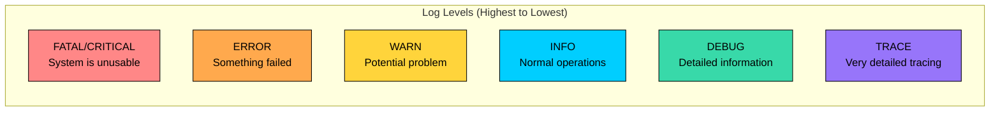
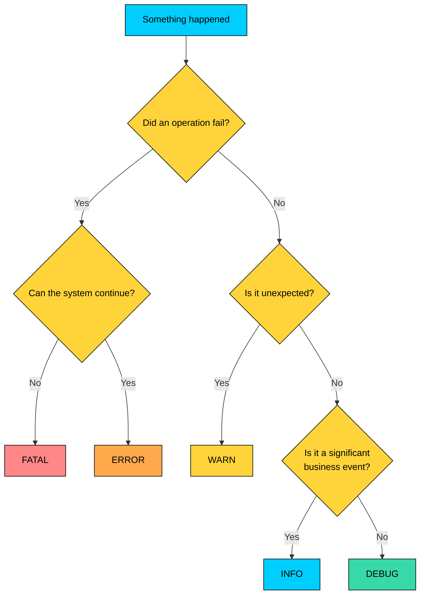
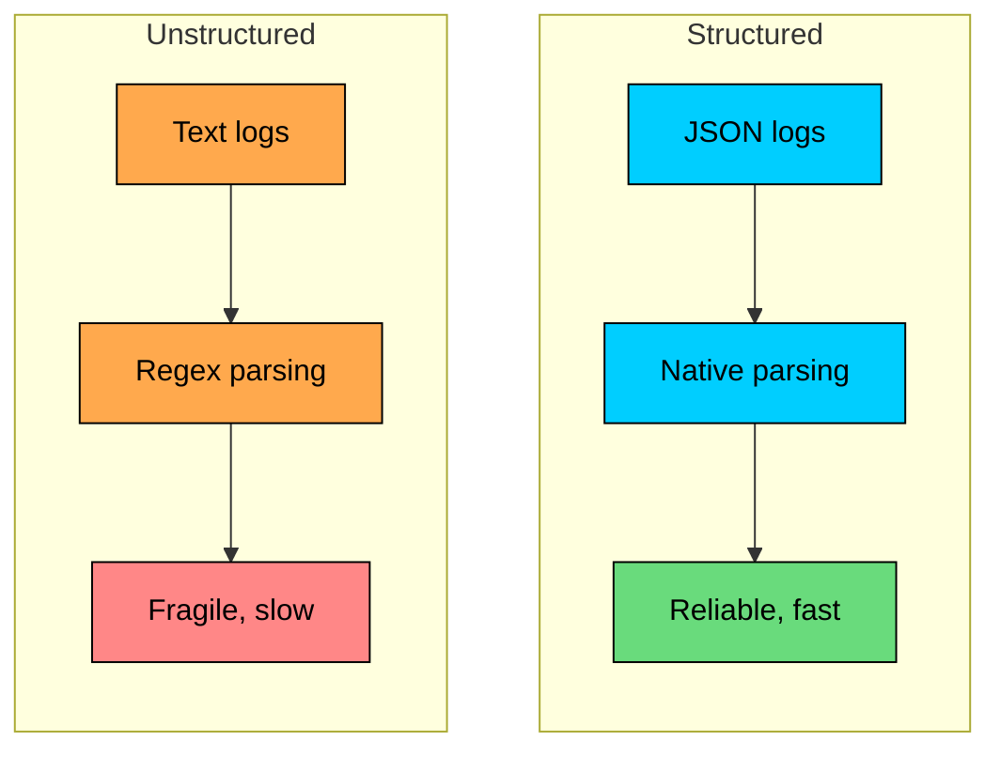
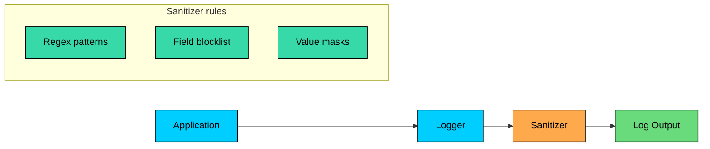
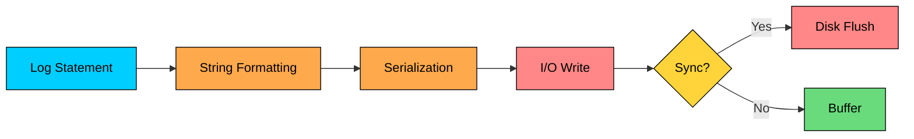
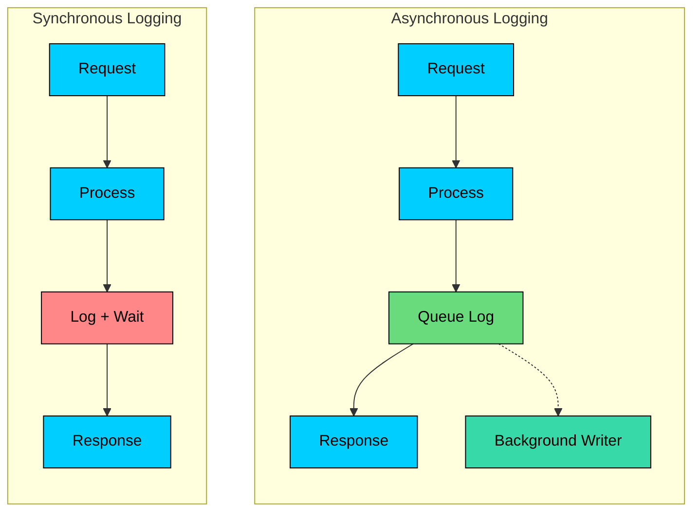
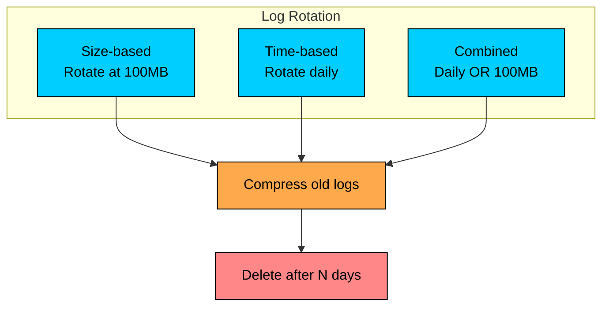

import React from 'react';
import CodeBlock from '../../../../components/ui/CodeBlock';
import Callout from '../../../../components/ui/Callout';

<div className="article-header">
  <div className="breadcrumb">
    <a href="/">Curated Notes</a>
    <span className="breadcrumb-separator">›</span>
    <span className="breadcrumb-current">Logging Best Practices</span>
  </div>
  <h1>Logging Best Practices</h1>
  <p style={{ color: 'var(--text-muted)', fontSize: '1.1rem', marginBottom: '16px', lineHeight: '1.6' }}>
    Master the essentials of Logging Best Practices in this curated guide.
  </p>
  <div className="meta-info">
    <span className="meta-item">
      <svg width="14" height="14" viewBox="0 0 24 24" fill="none" stroke="currentColor" strokeWidth="2"><circle cx="12" cy="12" r="10"/><polyline points="12 6 12 12 16 14"/></svg>
      10 min read
    </span>
    <span className="difficulty-badge difficulty-badge--intermediate">Intermediate</span>
  </div>
</div>

<section className="content-section">

Logging records meaningful events from a running system so engineers can understand what happened during normal operation, failures, and investigations.

In production systems, useful logs need context, structure, safe handling of sensitive data, and consistent fields across services. Without those qualities, logs become noisy text rather than operational evidence.

In this chapter, you will learn how to choose log levels, include useful context, use structured logs, avoid common mistakes, and keep logging efficient at scale.

---

## Log Levels

Log levels categorize messages by importance. Using them well is the foundation of useful logging, because levels decide what gets stored, what gets alerted on, and what gets ignored.

#### The Standard Levels





| Level | When to Use | Example | Production Setting |
|-------|-------------|---------|-------------------|
| **FATAL** | System cannot continue, immediate attention required | Database connection lost | Always logged |
| **ERROR** | Operation failed, needs investigation | Payment processing failed | Always logged |
| **WARN** | Something unexpected, but system continues | Retry succeeded after failure | Always logged |
| **INFO** | Normal business events worth recording | Order placed, job completed | Usually logged |
| **DEBUG** | Detailed information for debugging | SQL query executed, cache hit/miss | Disabled in production |
| **TRACE** | Very fine-grained tracing | Entering/exiting methods, loop iterations | Rarely used |


#### Choosing the Right Level

The most common mistake is overusing ERROR and underusing WARN.

**Bad Example:** Logging expected conditions as ERROR


```shell
ERROR: User not found for ID 12345
       (This is expected for invalid IDs - should be WARN or INFO)

ERROR: Request timeout, retrying...
       (Transient issues with retry - should be WARN)

ERROR: Cache miss for key user:789
       (Normal operation - should be DEBUG)
```


Ask yourself: **“Should this wake someone up at 2 AM?”** If yes, it is usually **ERROR** or **FATAL**. If no, it is probably **WARN** or lower.


&gt; **NOTE**
&gt;
&gt; ERROR logs should be actionable. If you cannot do anything about it, it probably should not be an ERROR.


#### Level Selection Guide





---

## What to Log

A log message is only useful if it contains enough information to understand what happened. The goal is simple: someone should be able to read one log line and immediately know what it means, what it affects, and what to do next.

#### The Essential Elements

Every log entry should answer these questions:


```shell
WHEN?    → Timestamp with timezone
WHERE?   → Service name, hostname, function/class
WHAT?    → Event description
WHO?     → User ID, request ID, session ID
WHY?     → Context that explains the situation
```


#### Good vs Bad Log Messages

#### Bad: vague and unhelpful


```shell
Error processing request
Something went wrong
Failed to connect
Unexpected error
null
```


#### Good: specific and actionable


```shell
Payment failed for order_id=12345 user_id=789: Card declined (error_code=card_declined)
Database connection timeout after 30s: host=db-primary.prod port=5432 pool_size=50/50
User authentication failed for email=john@example.com: Invalid password (attempt 3 of 5)
```


#### The Context Checklist

Before writing a log statement, ask: **“If I saw only this log line, would I understand what happened?”**

Always include identifiers such as `user_id`, `order_id`, `correlation_id`, or `request_id` when they apply. Add values like amount or size when relevant, state such as status or retry count during state changes, error details for failures, timing fields for performance-related events, and source details for external interactions.

#### Including the Right Amount of Context

**Too little context makes logs useless:**


```shell
Order failed
```


**Too much context creates noise:**


```shell
Order failed: order_id=12345, user_id=789, user_email=john@example.com,
user_name=John Doe, user_address=123 Main St, user_phone=555-1234,
created_at=2024-01-15T10:23:45Z, updated_at=2024-01-15T10:23:45Z,
product_id=456, product_name=Widget, product_price=29.99, quantity=3,
shipping_method=standard, payment_method=credit_card, ...
```


**Just right:**


```shell
Order failed: order_id=12345 user_id=789 error="insufficient_inventory"
product_id=456 requested_qty=3 available_qty=1
```


Include what you need to debug, nothing more.

---

## Structured Logging

Structured logging means writing logs in a machine-parseable format, typically JSON, rather than plain text.

#### Why Structured Logging Matters





With **unstructured** logs, you end up treating logs like text files: parsing with regex, maintaining rules for every format variation, and risking broken dashboards or alerts after small wording changes.

With **structured** logs, logs behave like data through native JSON parsing, consistent fields across services, and reliable filtering.

#### **Unstructured log:**


```shell
2024-01-15 10:23:45 INFO Order 12345 placed by user 789 for $99.50
```


Parsing this requires regex. Different log formats require different regex patterns. Slight format changes break your parsers.

#### **Structured log:**


```json
{
  "timestamp": "2024-01-15T10:23:45.123Z",
  "level": "INFO",
  "service.name": "order-service",
  "event.name": "order_placed",
  "order_id": "12345",
  "user_id": "789",
  "amount": 99.50,
  "currency": "USD"
}
```


Now you can query large orders with `event.name=order_placed AND amount>100`, all activity for a user with `user_id=789`, or order service errors with `service.name=order-service AND level=ERROR`.

#### Structured Logging Format

Use consistent field names across all services:


| Field | Type | Description | Required |
|-------|------|-------------|----------|
| `timestamp` | ISO 8601 | When the event occurred | Yes |
| `level` | string | Log level (INFO, ERROR, etc.) | Yes |
| `service.name` | string | Name of the service | Yes |
| `event.name` | string | What happened (snake_case) | Yes |
| `message` | string | Human-readable description | Optional |
| `trace_id` | string | Distributed trace ID | When available |
| `span_id` | string | Span that emitted the log | When available |
| `correlation_id` or `request_id` | string | Request or support correlation ID | When available |
| `user_id` | string | User identifier | When relevant |
| `error_code` | string | Error classification | For errors |
| `duration_ms` | number | Operation duration | For timed operations |


#### Implementation Example

Most languages have good structured logging support. The main idea is the same: log an event name and attach key-value context.


```shell
Java (Logback + Logstash encoder):
─────────────────────────────────────
MDC.put("orderId", orderId);
MDC.put("userId", userId);
logger.info("Order placed successfully");
// Outputs JSON with all MDC fields

Python (structlog):
─────────────────────────────────────
logger.info("order_placed", order_id=12345, user_id=789, amount=99.50)
// Outputs JSON with all parameters

Node.js (pino):
─────────────────────────────────────
logger.info({ orderId: 12345, userId: 789, amount: 99.50 }, 'Order placed');
// Outputs JSON with all fields
```


Once your logs are structured, you can filter, group, and correlate across services without fighting formatting.

---

## Logging Sensitive Data

One of the biggest logging risks is accidentally exposing sensitive information. Logs get shipped to central systems, copied into tickets, and shared across teams. If a secret lands in logs, assume it will leak.

#### What Not to Log

Never log passwords, API keys, secrets, credit card numbers, government identifiers, full session tokens, refresh tokens, JWTs, or personal health information. Treat email addresses, phone numbers, and IP addresses carefully; depending on policy and regulation, they may need masking or exclusion.

#### Masking Techniques

When you need to reference sensitive data for debugging, log the minimum needed for correlation.

#### Bad (exposing full values):


```shell
Credit card: 4111111111111111
Email: john.doe@example.com
API Key: sk_live_abcd1234efgh5678
```


#### Good (masked for safety):


```shell
Credit card: ****1111
Email: j***@e***.com
API Key: sk_live_****5678
```


#### Automatic Sanitization

Do not rely on developers remembering to redact every time. Add sanitization to the logging pipeline so it happens by default.





Typical controls include field blocklists for keys like `password`, `token`, `authorization`, and `api_key`, value masks for safe partial reveals, and regex detection for secrets embedded in free-text logs.

Useful detection patterns include credit card numbers like `\b\d{4}[\s-]?\d{4}[\s-]?\d{4}[\s-]?\d{4}\b`, API keys like `(api[_-]?key|secret)[=:]\s*\w+`, passwords in URLs like `password=\w+`, and bearer tokens like `Bearer\s+\w+`.

---

## Performance Considerations

Logging is not free. In high-throughput systems, even “small” logging overhead can become a real performance and cost problem.

#### The Cost of Logging





A typical log line can trigger string formatting, JSON serialization, memory allocations, and I/O to disk or the network. The expensive part is almost always **I/O**, especially if it happens on the request thread.

#### Performance Best Practices

#### 1. Use lazy evaluation

Do not compute expensive values if the log will not be written.

**Bad (always computes expensive data):**


```java
logger.debug("User data: " + expensiveSerialize(userData));
```


**Good (only computes if debug is enabled):**


```java
if (logger.isDebugEnabled()) {
    logger.debug("User data: " + expensiveSerialize(userData));
}
```


**Better (let the framework defer evaluation when supported):**


```java
logger.debug("User data: {}", () -> expensiveSerialize(userData));
```


#### 2. Use async logging

Synchronous logging can block request processing while waiting for disk or network.





With synchronous logging, the request waits while the log is written. With asynchronous logging, the request enqueues the log and returns while a background thread writes to disk or ships over the network.

Async logging queues log messages and writes them in a background thread. This prevents I/O from blocking request processing.

#### 3. Pick the right production log level

Use DEBUG or TRACE in development, DEBUG in staging, INFO as the normal production default, and temporary scoped DEBUG during incidents.

A common practice is “INFO by default, DEBUG on demand,” with a time limit and scope (specific service, endpoint, or user) so you do not drown in noise.

#### 4. Sample high-volume events

For events that happen constantly (cache hits, heartbeats), log only a sample.

**Probabilistic sampling (1%):**


```java
if (random.nextFloat() < 0.01f) {
    logger.debug("Cache hit: key={} latency_ms={}", key, latencyMs);
}
```


**Deterministic sampling (every 1000th event):**


```java
hitCounter.increment();
if (hitCounter.get() % 1000 == 0) {
    logger.info("Cache hits so far: {}", hitCounter.get());
}
```


If you want accurate counts, do not rely on logs for that. Use **metrics** (counters, histograms) and keep logs for context.

#### Rough performance impact (ballpark)

These numbers vary by language, hardware, and logging pipeline, but they help build intuition. Synchronous disk logging can add 1-10ms per log because it blocks the request, asynchronous disk logging is often below 0.1ms per log, synchronous network logging can add 5-50ms, JSON serialization often costs 0.01-0.1ms, and simple string formatting is usually much cheaper.

At **10,000 requests/sec**, even **0.1ms** of extra overhead per request adds up fast. That is roughly **1 second of CPU time per second**, just for logging work.

The goal is not “log less.” It is “log smarter”: correct levels, structured context, async I/O, and sampling where needed.

---

## Common Logging Mistakes

Avoid these patterns that make logs less useful:

#### 1. Logging Without Context


```shell
Bad:
Error occurred
Connection failed
Null pointer exception

Good:
Order processing failed: order_id=12345 error="inventory_unavailable"
Database connection failed: host=db-01 port=5432 timeout_ms=5000
Null pointer in getUserProfile: user_id=789 field="preferences"
```


#### 2. Inconsistent Formats


```shell
Bad (different formats across services):
─────────────────────────────────────
[2024-01-15 10:23:45] INFO - User logged in
2024/01/15 10:23:45 ERROR: Payment failed
{"time":"2024-01-15T10:23:45","msg":"Order placed"}

Good (consistent format):
─────────────────────────────────────
{"timestamp":"2024-01-15T10:23:45Z","level":"INFO","service.name":"auth-service","event.name":"user_login",...}
{"timestamp":"2024-01-15T10:23:45Z","level":"ERROR","service.name":"payment-service","event.name":"payment_failed",...}
{"timestamp":"2024-01-15T10:23:45Z","level":"INFO","service.name":"order-service","event.name":"order_placed",...}
```


#### 3. Excessive Logging


```shell
Bad (logging inside tight loops):
─────────────────────────────────────
for (item in items) {  // 10,000 items
    logger.debug("Processing item: " + item.id);
    process(item);
    logger.debug("Processed item: " + item.id);
}

Good (log aggregates):
─────────────────────────────────────
logger.info("Processing batch", batchSize=items.size());
for (item in items) {
    process(item);
}
logger.info("Batch complete", processed=items.size(), duration_ms=elapsed);
```


#### 4. Swallowing Exceptions


```shell
Bad (losing the stack trace):
─────────────────────────────────────
try {
    processOrder(order);
} catch (Exception e) {
    logger.error("Order failed");  // Where? Why? No stack trace!
}

Good (preserving full context):
─────────────────────────────────────
try {
    processOrder(order);
} catch (Exception e) {
    logger.error("Order processing failed",
                 orderId=order.id,
                 userId=order.userId,
                 exception=e);  // Include the exception
}
```


#### 5. Log Message in Code, Context in Exception


```shell
Bad:
─────────────────────────────────────
throw new RuntimeException("Failed for order " + orderId);
// Message lost if exception is caught and logged differently

Good:
─────────────────────────────────────
logger.error("Order processing failed", orderId=orderId);
throw new OrderProcessingException(orderId);
```


---

## Log Rotation and Retention

Logs consume disk space. If you do not manage them, they will eventually fill the disk and take your service down in the most avoidable way.

#### Rotation Strategies

Rotation means closing the current log file and starting a new one on a schedule.





The most common strategies are size-based rotation when a file reaches a limit such as 100MB, time-based rotation on a schedule such as daily at midnight, or a combined policy that rotates when either condition is met.

After rotation, it is common to compress older files with gzip and delete logs after a retention window.

#### Retention Guidelines

Retention depends on what the logs are used for and whether compliance applies.


| Log Type | Retention | Reason |
|----------|-----------|--------|
| Application logs | 7-30 days | Debugging recent issues |
| Access logs | 30-90 days | Traffic analysis, security |
| Audit logs | 1-7 years | Compliance requirements |
| Security logs | 1-7 years | Incident investigation |
| Debug logs | 1-7 days | Short-term debugging |


**Tip:** keep long-term logs in cheaper storage (object storage) and keep hot logs in the logging system for fast search.

---

## Summary

Effective logging requires intentional design. Log levels control importance, context makes entries useful, structured JSON makes logs searchable, sanitization protects sensitive data, async I/O and lazy evaluation keep overhead manageable, and rotation plus retention prevent logs from becoming a reliability problem.

Before adding a log, ask whether it would help during an incident. Prefer structured fields, include correlation identifiers where useful, avoid sensitive data, and sample high-frequency events instead of logging everything.

---

## Quiz

</section>
