import React from 'react';
import CodeBlock from '../../../../components/ui/CodeBlock';
import Callout from '../../../../components/ui/Callout';

<div className="article-header">
  <div className="breadcrumb">
    <a href="/">Curated Notes</a>
    <span className="breadcrumb-separator">›</span>
    <span className="breadcrumb-current">Monolithic Architecture</span>
  </div>
  <h1>Monolithic Architecture</h1>
  <p style={{ color: 'var(--text-muted)', fontSize: '1.1rem', marginBottom: '16px', lineHeight: '1.6' }}>
    Master the essentials of Monolithic Architecture in this curated guide.
  </p>
  <div className="meta-info">
    <span className="meta-item">
      <svg width="14" height="14" viewBox="0 0 24 24" fill="none" stroke="currentColor" strokeWidth="2"><circle cx="12" cy="12" r="10"/><polyline points="12 6 12 12 16 14"/></svg>
      10 min read
    </span>
    <span className="difficulty-badge difficulty-badge--intermediate">Intermediate</span>
  </div>
</div>

<section className="content-section">

Monolithic architecture packages an application as one deployable unit, even when its code is split into internal modules.

It keeps development and operations simple, but it needs clear boundaries, ownership, tests, and release discipline as the system grows.

This chapter covers what defines a monolithic architecture, how layered and modular monoliths are structured, where they work well, where they become painful, and how to evolve them gradually.

---

## 1. What Is a Monolith?


&gt; **What is a Monolith?**
&gt;
&gt; A monolith is an application whose major features are packaged, deployed, and scaled together as one unit.


A monolith has one primary runtime and one deployment lifecycle.


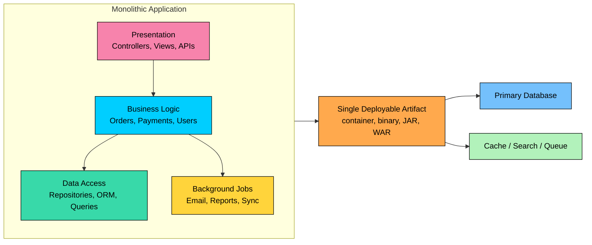


The defining traits are:

- **Single deployment unit:** A change to any part of the application normally produces one release artifact.
- **Shared runtime boundary:** Modules communicate through in-process calls rather than network APIs.
- **Centralized operational model:** The application is monitored, scaled, and rolled back as one system.
- **Shared data layer in many cases:** Many monoliths use one primary database, although a disciplined monolith can still separate schemas, tables, or data access ownership by domain.

A monolith does not have to mean one file, one package, one team, or no architecture. A well-designed monolith has clear modules and ownership. A poorly designed monolith is just accidental coupling in one process.

---

## 2. Anatomy of a Monolith

Good monoliths are structured both horizontally and vertically.

### Layered Structure

Horizontal layers separate technical responsibilities.


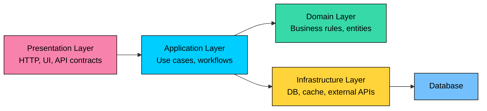


| Layer | Responsibility | Examples |
| --- | --- | --- |
| **Presentation** | Accept requests and return responses | Controllers, REST endpoints, views |
| **Application** | Coordinate use cases | Checkout flow, account update, refund workflow |
| **Domain** | Enforce business rules | Order, invoice, payment policy, inventory rule |
| **Infrastructure** | Talk to external systems | Database repositories, queues, payment provider clients |


Layering keeps technical concerns from bleeding everywhere. It is helpful, but layering alone is not enough. Large systems also need boundaries around business domains.

### Modular Structure

Vertical modules group code by business capability.


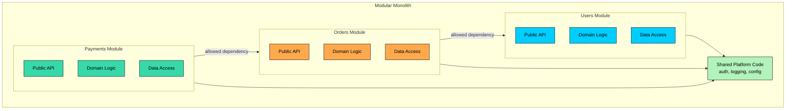


A **modular monolith** keeps one deployment unit but enforces boundaries between modules. Each module owns its domain logic and exposes a small public interface. Other modules should not reach into its internal classes, tables, or implementation details.

This is often the best middle ground for teams that want strong domain boundaries without the operational cost of microservices.

---

## 3. How a Monolith Handles Requests

A monolith handles a request with in-process calls until it reaches an external dependency such as a database, cache, queue, or third-party API.


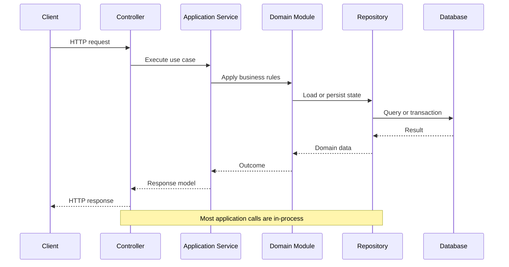


This gives a monolith several practical benefits:

- **Simple call flow:** Function calls are easier to reason about than distributed request chains.
- **Local transactions:** A single database transaction can cover related changes when they live in the same data store.
- **Simpler debugging:** A stack trace often shows the full application path.
- **Lower latency inside the application:** In-process calls avoid serialization, network hops, timeouts, and partial failures between modules.

The tradeoff is that everything shares the same runtime. A memory leak, slow dependency, overloaded thread pool, or bad deployment can affect the whole application.

---

## 4. Advantages of Monolithic Architecture

### Simple Development

Developers can often run the entire application locally.


```shell
Typical local workflow
──────────────────────
1. Clone one repository
2. Start the database and supporting services
3. Run one application
4. Test the full request path locally
```


This is especially valuable early in a product, when the domain is still changing and teams need fast feedback.

### Simple Deployment


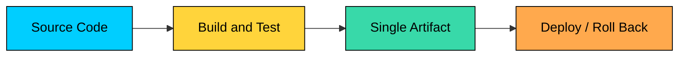


There are no cross-service version matrices, no distributed contract rollout, and fewer moving parts during release. Blue-green deployments, rolling deploys, and canaries are still useful, but the release unit is easier to understand.

### Strong Transactional Boundaries

When related data lives in one database, transactions are straightforward.


```java
@Transactional
public void capturePaymentAndCreateOrder(OrderRequest request) {
    Order order = orderRepository.create(request);
    paymentRepository.capture(order.paymentId(), order.total());
    auditRepository.record("ORDER_CREATED", order.id());
}
```


In a distributed system, the same workflow may require sagas, outbox tables, idempotency keys, compensating actions, and eventual consistency.

### Lower Operational Overhead

A monolith usually means:

- Fewer deployable services
- Fewer dashboards and alerts
- Fewer network calls
- Fewer service-to-service authentication paths
- Fewer compatibility contracts to maintain

This matters. Many teams fail with microservices because they take on distributed-systems complexity before they have the team size, tooling, or operational maturity to support it.

### Easier Refactoring

A well-tested monolith is often easier to refactor than a distributed system. You can change method names, move classes, update schemas, and adjust workflows in one coordinated commit.

Cross-service refactoring is slower because it requires compatibility windows, staged deploys, data migrations, and careful rollback plans.

---

## 5. Disadvantages of Monolithic Architecture

Monoliths fail when coupling grows faster than discipline.

### Scaling Limitations

A monolith scales as a whole.


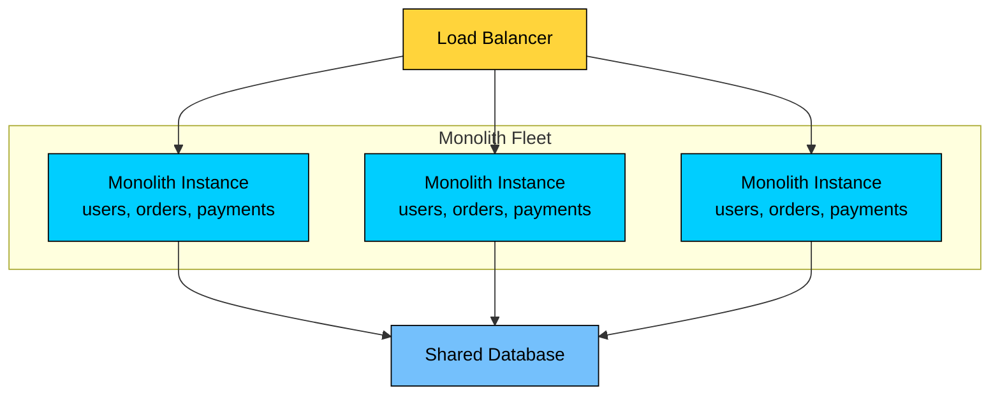


If one workload needs more CPU, more memory, or different hardware, you scale the entire application unless you extract that workload or isolate it internally.

This is not always a problem. Many applications scale horizontally as monoliths for a long time. It becomes a problem when different modules have sharply different resource profiles.

### Deployment Coupling

Every release touches the whole application. A five-line change in user settings still ships with orders, billing, reporting, and admin code.

That coupling increases test cost and release risk. Strong automated tests, feature flags, canary deploys, and fast rollback reduce the risk, but they do not remove the shared release lifecycle.

### Shared Runtime Failure

One module can consume shared resources and harm unrelated features:

- A memory leak in report generation can crash the process.
- A slow external API call can exhaust request threads.
- A bad database query can saturate the shared connection pool.
- A CPU-heavy export job can degrade user-facing requests.

Bulkheads, timeouts, separate worker pools, queues, and rate limits help, but process isolation is weaker than in independently deployed services.

### Codebase and Build Growth

Large monoliths can suffer from:

- Slow builds
- Slow tests
- Long startup time
- Expensive CI pipelines
- Large dependency graphs
- Difficult onboarding

These are engineering problems, not destiny. They require investment in build tooling, test strategy, dependency management, and module ownership.

### Technology Constraints

A monolith tends to standardize on one main language, framework, runtime, and database approach. That consistency is useful, but it can slow adoption of specialized tools.

For example, an AI-heavy recommendation pipeline may need Python libraries, GPU workers, vector indexing, or batch processing that does not fit cleanly inside the main application runtime.

The answer is not always "rewrite as microservices." Often the right move is to keep the core monolith and extract only the specialized workload.

### Team Coordination

As the number of developers grows, coordination becomes harder.


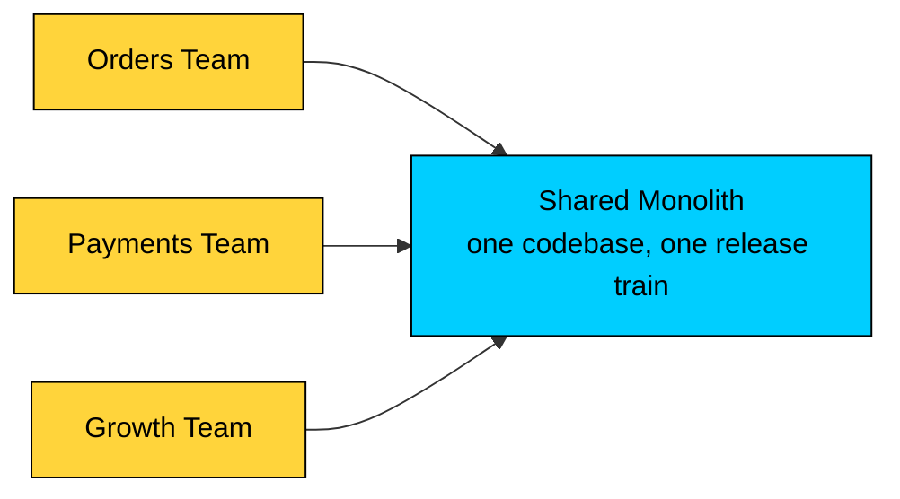


Without clear ownership, teams step on each other through shared models, shared tables, shared utilities, and broad changes that cross domains.

---

## 6. Common Failure Mode: The Big Ball of Mud

The danger is not the monolith itself. The danger is accidental coupling.


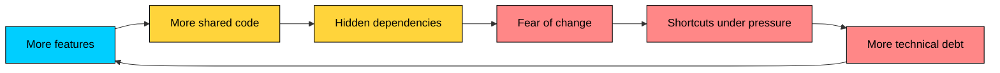


The symptoms are familiar:

- Nobody knows who owns a module.
- Any module can call any other module's internals.
- Database tables are updated from unrelated areas.
- Test failures are hard to connect to the change that caused them.
- Developers copy patterns because the correct path is unclear.
- Releases become slow because the blast radius is unknown.

This pattern is preventable. It requires boundaries that are visible in code and enforced by tools, tests, reviews, and ownership.

---

## 7. Managing Monolith Complexity

### Enforce Module Boundaries

Modules should communicate through explicit public interfaces.


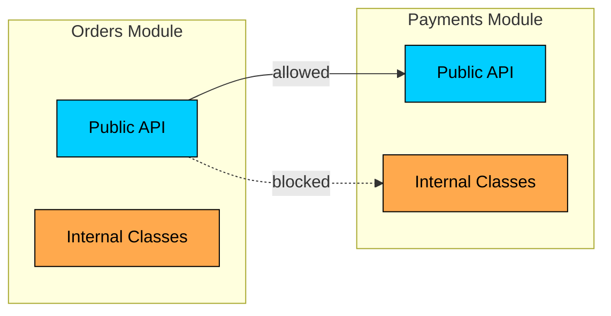


Useful techniques include:

- Package visibility and internal modules
- Static architecture tests
- Dependency rules enforced in CI
- Code owners by module
- Explicit public APIs between modules
- Clear rules for shared libraries

### Organize by Domain

Prefer business-oriented modules over purely technical folders.


```shell
app/
├── orders/
│   ├── api/
│   ├── application/
│   ├── domain/
│   └── infrastructure/
├── payments/
│   ├── api/
│   ├── application/
│   ├── domain/
│   └── infrastructure/
└── platform/
    ├── auth/
    ├── logging/
    └── config/
```


This makes ownership clearer and reduces the chance that every change touches generic `services`, `models`, or `utils` folders.

### Protect the Data Boundary

Even with one database, modules should own their tables or schemas.


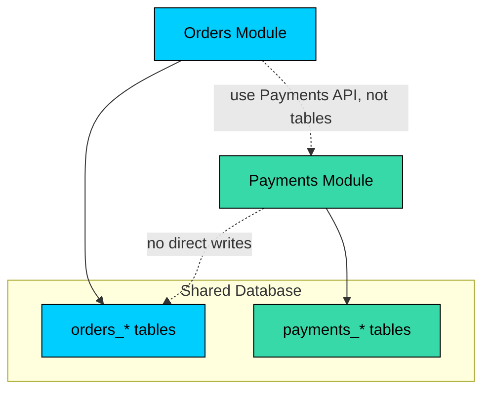


This discipline makes future extraction possible. If every module reads and writes every table, service extraction becomes a data migration nightmare.

### Separate Heavy Workloads

Not every workload belongs in the request path. A healthy monolith often uses background workers, queues, caches, search indexes, and specialized jobs.

Examples:

- Send emails through a queue.
- Run report generation in workers.
- Process uploaded media asynchronously.
- Generate embeddings outside the web request.
- Use a search index for full-text search.

This keeps the monolith simple without forcing every capability into the same synchronous runtime path.

### Keep Build and Test Feedback Fast

A monolith needs a serious test strategy:

- Fast unit tests for domain logic
- Focused integration tests for database and framework behavior
- Contract tests for external APIs
- End-to-end tests for critical user journeys
- Test selection or impact analysis for large codebases

If every pull request waits hours for feedback, developers will batch changes and releases will become riskier.

---

## 8. When to Choose a Monolith


| Indicator | Why a Monolith Works |
| --- | --- |
| **New product** | The domain will change; one codebase is easier to reshape. |
| **Small team** | Coordination cost is low and distributed ownership is unnecessary. |
| **Strong transactions** | A single data store simplifies consistency. |
| **Unclear boundaries** | It is easier to discover boundaries before turning them into services. |
| **Limited operations capacity** | One deployable system is easier to run than many services. |
| **Fast iteration matters** | Fewer moving parts usually means faster early delivery. |


Choose a monolith when simplicity is the advantage. Add modularity early, but avoid premature distribution.

---

## 9. Signs You Are Outgrowing a Monolith


| Warning Sign | What It Usually Means |
| --- | --- |
| **One module needs different scaling** | The workload may need isolation or extraction. |
| **Builds and tests take too long** | Tooling and module boundaries need investment. |
| **Small changes cause unrelated failures** | Internal coupling is too high. |
| **Teams block each other on releases** | Ownership and deployment lifecycle are misaligned. |
| **One dependency constrains the whole app** | Specialized workloads may need a separate runtime. |
| **Database ownership is unclear** | Future extraction will be expensive. |


Do not jump straight from these symptoms to microservices. First ask whether the monolith can be modularized, whether a single workload can be extracted, or whether the deployment pipeline needs improvement.

---

## 10. Evolving a Monolith

The safest path is usually gradual.

1. **Modularize internally.** Define domain boundaries, ownership, and allowed dependencies.
2. **Stabilize data ownership.** Stop cross-module table access where possible.
3. **Move asynchronous work out of request paths.** Use queues and workers.
4. **Extract only clear candidates.** Start with workloads that have different scaling, reliability, or technology needs.
5. **Use the strangler pattern.** Route a slice of behavior to a new service while the monolith continues to serve the rest.
6. **Keep contracts explicit.** Use APIs, events, schemas, and compatibility tests.


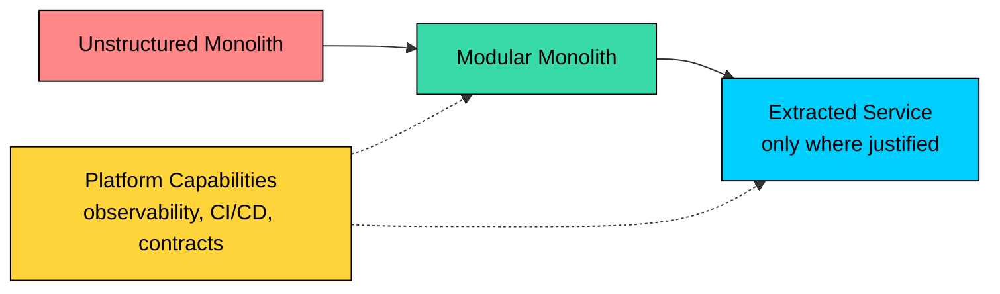


The goal is not to escape the monolith. The goal is to put boundaries where they create real engineering leverage.

---

## 11. Real-World Perspective

Large engineering organizations have taken different paths, but a common lesson shows up repeatedly: architecture should follow the product, team, and operational constraints.

- **Shopify** has written publicly about evolving from a monolith toward a modular monolith: one codebase with enforced boundaries between components.
- **Stack Overflow** has argued that distributed architectures solve some scaling problems while reintroducing problems that monoliths avoid, especially around state and transactions.
- **Basecamp and Rails-oriented teams** often advocate monoliths because simpler deployment and tighter feedback loops are a good fit for many products.

These examples do not mean every company should copy their architecture. They show that monoliths can remain viable when teams invest in boundaries, performance, tests, and operations.

---

## 12. Key Takeaways

- A monolith is one deployable application, not necessarily one unstructured codebase.
- Monoliths are often the right starting point because they reduce operational and distributed-systems complexity.
- A modular monolith gives you domain boundaries without independent service deployment.
- The main risks are hidden coupling, shared runtime failures, slow builds, unclear ownership, and deployment coupling.
- Do not split a monolith just because it is large. Split when a boundary has clear scaling, reliability, ownership, or technology reasons.
- A well-maintained monolith is better than a poorly designed microservice system.

---

## Quiz

</section>
