import React from 'react';
import CodeBlock from '../../../../components/ui/CodeBlock';
import Callout from '../../../../components/ui/Callout';

<div className="article-header">
  <div className="breadcrumb">
    <a href="/">Curated Notes</a>
    <span className="breadcrumb-separator">›</span>
    <span className="breadcrumb-current">Service Discovery</span>
  </div>
  <h1>Service Discovery</h1>
  <p style={{ color: 'var(--text-muted)', fontSize: '1.1rem', marginBottom: '16px', lineHeight: '1.6' }}>
    Master the essentials of Service Discovery in this curated guide.
  </p>
  <div className="meta-info">
    <span className="meta-item">
      <svg width="14" height="14" viewBox="0 0 24 24" fill="none" stroke="currentColor" strokeWidth="2"><circle cx="12" cy="12" r="10"/><polyline points="12 6 12 12 16 14"/></svg>
      10 min read
    </span>
    <span className="difficulty-badge difficulty-badge--intermediate">Intermediate</span>
  </div>
</div>

<section className="content-section">

In a monolith, components call each other inside one process. In a distributed system, that call becomes a network request to an instance whose address can change at any time.

Containers restart, autoscalers add capacity, nodes fail, deploys replace old instances, and traffic shifts between regions. Hardcoded addresses quickly become stale.

**Service discovery** maps a stable logical service name, such as `payment-api`, to the set of currently usable network endpoints behind that service.

The goal is simple: callers should depend on service names, while the platform keeps track of healthy, current instances.

---

## The Problem: Addresses Are Not Stable

Consider an order service that calls inventory and payment services.

In a small static deployment, configuration like this may look harmless:


```shell
inventory.service.host=192.168.1.10:8080
payment.service.host=192.168.1.11:8080
```


The first outage teaches the lesson.


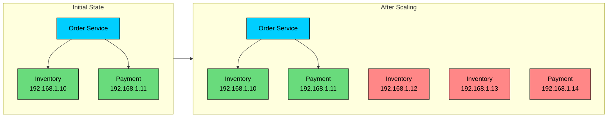


The new inventory and payment instances exist, but order traffic still goes to the original addresses. Capacity was added, but the caller cannot use it.

The failure cases are predictable:


| Scenario | What Breaks |
|----------|-------------|
| **Scale out** | New instances do not receive traffic |
| **Scale in** | Clients keep calling removed instances |
| **Instance failure** | Traffic continues to hit dead endpoints until configuration changes |
| **Rolling deployment** | Old and new instances overlap, but clients may only know one side |
| **Container restart** | Pod or task IPs change even when the logical service did not |
| **Multi-region failover** | Clients need a way to move from one pool of endpoints to another |


Service discovery replaces this brittle configuration with an automatically maintained mapping:


```shell
inventory-api.production.svc.cluster.local -> 10.0.12.8:8080, 10.0.15.3:8080
payment-api.production.svc.cluster.local   -> 10.0.21.4:8080, 10.0.22.9:8080
```


The caller asks for `payment-api`. The platform decides which healthy instance should receive the request.

---

## What Service Discovery Provides

A service discovery system usually provides three capabilities.

1. **Registration:** The platform records that an instance exists.
2. **Discovery:** Clients or proxies look up usable endpoints for a logical service name.
3. **Health filtering:** Failed, starting, and draining instances are removed from normal traffic.


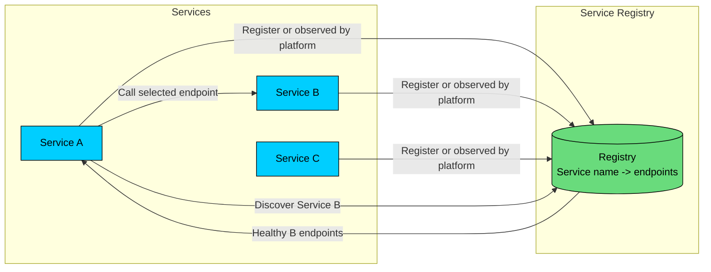


The registry may be an explicit product such as Consul, a control-plane store such as etcd behind Kubernetes, cloud service discovery such as AWS Cloud Map, or a service-mesh control plane feeding proxies through xDS. The implementation varies. The contract stays the same: names resolve to healthy endpoints.

---

## Service Registry

The service registry is the source of discovery data. It tracks:

- Service name
- Instance address and port
- Health and readiness state
- Zone, region, and environment
- Version, shard, model, tenant, or capability metadata

Metadata affects routing decisions. A request for `embedding-service` may need a CPU pool for background indexing, while a latency-sensitive chat request needs a GPU pool in the caller's region. A canary release may expose `version=v3` to only 1% of traffic.

#### Registration Process

Registration can be explicit or platform-managed.


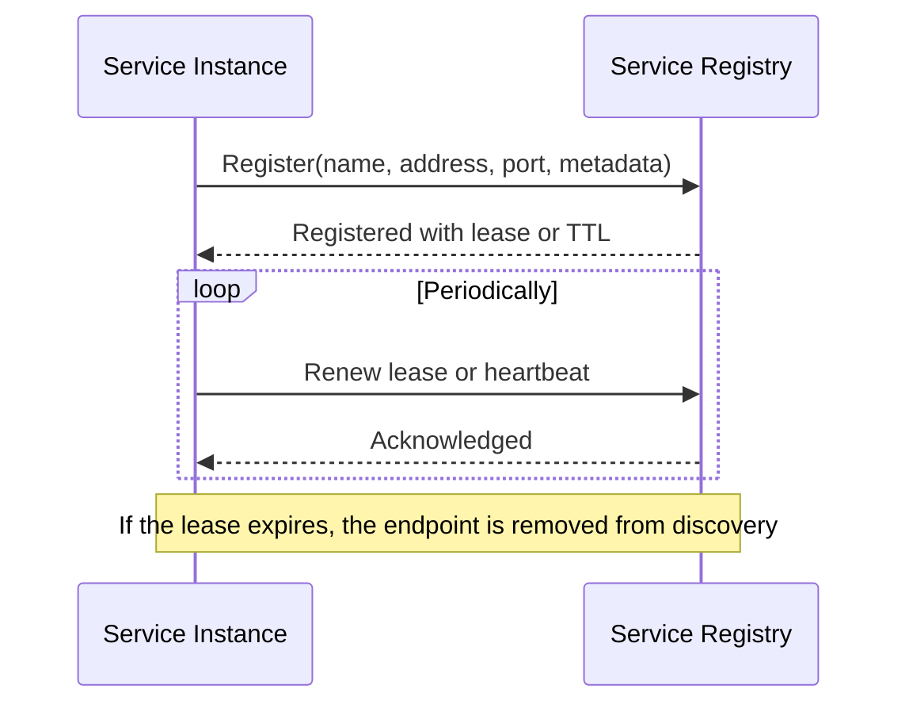


In orchestrated environments, the service process often does not register itself. The platform already knows which pods, tasks, or VMs exist and updates the registry from control-plane state.

#### Registration Patterns

**Self-registration:** The service registers itself with the registry during startup and renews its lease while it runs.


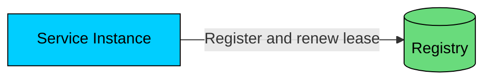


Self-registration is simple in a homogeneous stack, but it leaks infrastructure concerns into application code. Every language runtime needs a correct client library. Every service needs correct startup, shutdown, retry, and authentication behavior.

**Platform registration:** The scheduler, node agent, sidecar, or controller observes workloads and updates discovery records.


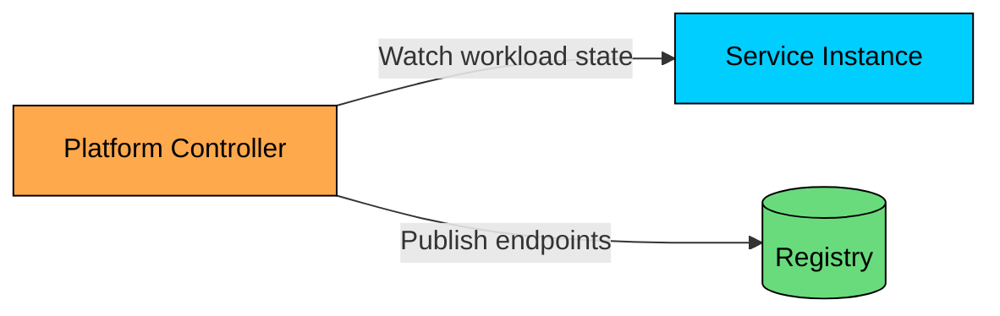


Kubernetes follows this model. Pods are selected by Services, readiness gates determine whether they are eligible for traffic, and EndpointSlices hold the backend endpoint set at scale.

Platform registration is the common default today because it keeps application code simpler and makes discovery behavior consistent across languages.

---

## Discovery Patterns

There are three patterns you should recognize: DNS discovery, client-side discovery, and server-side discovery. Production systems often combine them.

---

## DNS-Based Discovery

DNS is the most common discovery interface because every runtime can resolve a name.

In Kubernetes, a service named `payment-api` in namespace `production` can be addressed as:


```shell
payment-api.production.svc.cluster.local
```


A normal Kubernetes Service resolves to a stable ClusterIP. A headless Service resolves directly to the backing pod IPs. Consul also exposes service discovery through DNS names such as:


```shell
payment-api.service.consul
```


DNS discovery is easy to adopt, but it has sharp edges:

- DNS answers are cached. Low TTLs improve freshness but increase query load.
- Not every client respects TTLs exactly.
- DNS tells you where something is; it does not give you rich per-request routing by itself.
- Long-lived HTTP/2 or gRPC connections may keep using an old endpoint until the connection is recycled.

For many services, DNS plus a platform load balancer is enough. For latency-sensitive model serving or high-cardinality routing, teams usually add a smarter client, gateway, or service mesh.

---

## Client-Side Discovery

In client-side discovery, the caller obtains a list of healthy endpoints and chooses one.


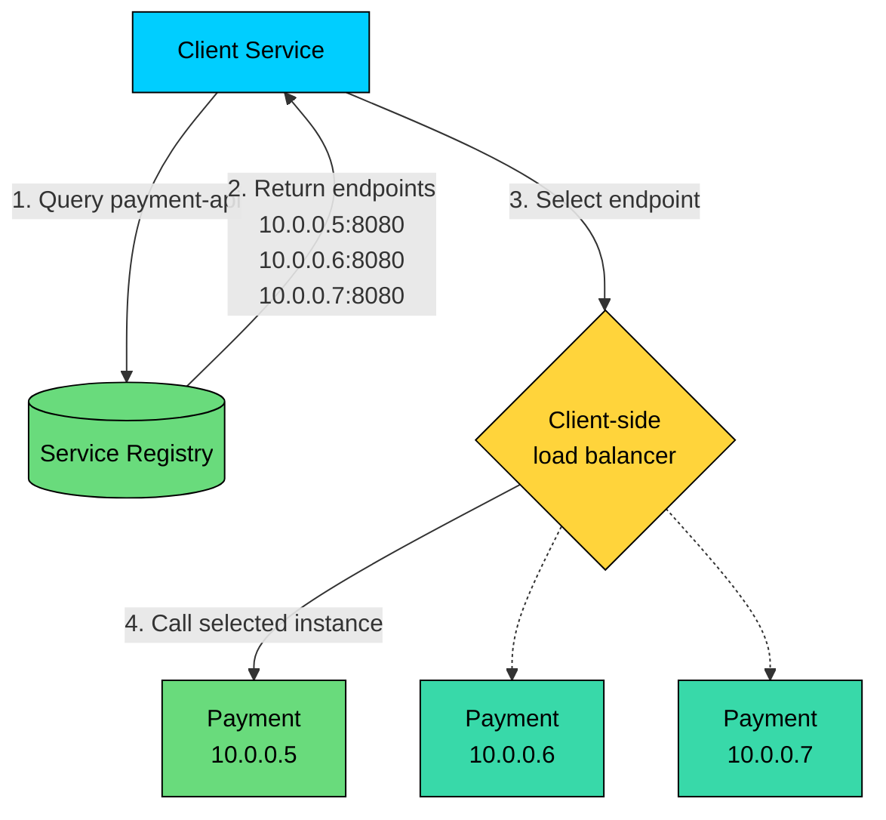


The client may use round robin, random selection, least requests, locality preference, consistent hashing, or weighted routing. For example, an embedding service client may prefer endpoints in the same availability zone to avoid cross-zone latency and data-transfer cost. A cache client may use consistent hashing so the same key tends to land on the same backend.

#### Client-Side Discovery Example: Eureka

Netflix Eureka is the classic example from the early cloud microservices era. Services register with Eureka, clients fetch registry snapshots, and client libraries choose instances locally.


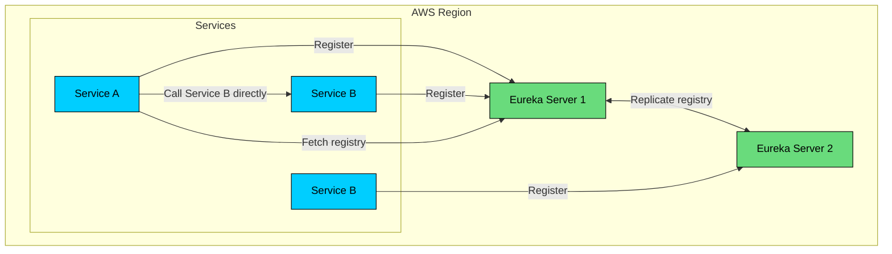


Eureka is still useful to understand, especially in Java/Spring systems that adopted Netflix OSS. For greenfield systems, the center of gravity has moved toward Kubernetes Services, cloud-native discovery, Consul, and service-mesh control planes. Ribbon, the old Netflix client-side load balancer often mentioned with Eureka, is no longer the default recommendation in modern Spring Cloud stacks.

#### Advantages of Client-Side Discovery

- **No proxy hop:** The client can call the selected instance directly.
- **Local control:** The client can use service-specific routing and retry rules.
- **Fast failover:** A client with a fresh local endpoint cache can avoid a known bad instance quickly.
- **Useful for stateful routing:** Consistent hashing and shard-aware routing are easier at the caller.

#### Disadvantages of Client-Side Discovery

- **Client complexity:** Every client needs correct discovery, load balancing, retries, backoff, and connection handling.
- **Language drift:** Java, Go, Python, and Node clients may behave differently unless carefully standardized.
- **Stale views:** Cached endpoint lists can lag behind reality.
- **Registry coupling:** Application code often becomes tied to a specific discovery API.

Client-side discovery is powerful, but it requires discipline. The failure modes live in every caller.

---

## Server-Side Discovery

In server-side discovery, the client sends traffic to a stable endpoint. A load balancer, proxy, gateway, or node-level data plane discovers the backend instances and forwards the request.


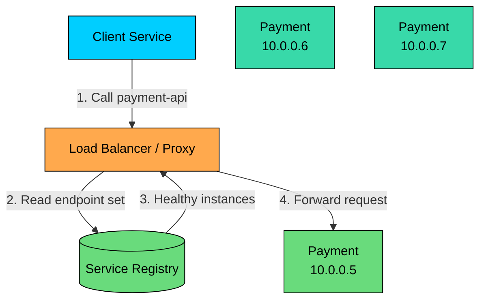


Kubernetes Services are the standard example. The client resolves a service name through cluster DNS, receives a stable virtual IP for a normal Service, and the cluster networking layer sends traffic to one of the ready backends.


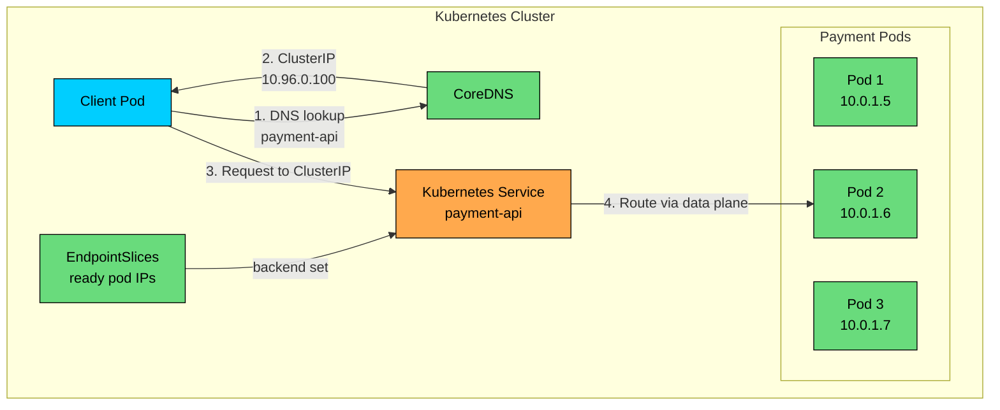


Modern Kubernetes clusters usually use CoreDNS for service-name resolution. EndpointSlices replaced the older Endpoints API for scalable backend tracking. Traffic may be implemented through kube-proxy with iptables or IPVS, or through an eBPF-based data plane such as Cilium. Do not assume every cluster routes traffic the same way.

#### Advantages of Server-Side Discovery

- **Simple clients:** Clients call a stable name or address.
- **Language agnostic:** Any runtime that can make network calls can participate.
- **Centralized policy:** Load balancing, health filtering, and routing rules live in infrastructure.
- **Operational consistency:** Platform teams can improve routing without changing every service.

#### Disadvantages of Server-Side Discovery

- **Proxy or data-plane dependency:** If that layer is unhealthy, many services are affected.
- **Less caller-specific logic:** Fine-grained routing can require extra configuration.
- **Possible extra hop:** A gateway or proxy may add latency, though node-local data planes often avoid a separate network hop.
- **Hidden behavior:** Application developers may not see why a request was routed to a given instance unless observability is good.

---

## Service Mesh Discovery

A service mesh moves much of discovery, load balancing, retries, and security into sidecars or node-level proxies. The application calls a local or transparent proxy. The mesh control plane distributes endpoint data and routing policy to the proxies.


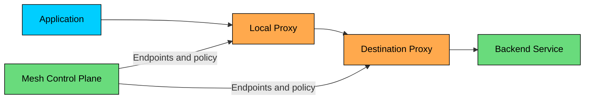


This model is common with Envoy-based systems. It works well when teams need mutual TLS, traffic splitting, retries, outlier detection, and detailed telemetry across many services.

The tradeoff is operational cost. A mesh adds another control plane, more moving parts, and another place to debug latency. Use it when the organization needs the control it provides. Many microservice systems run well without one.

---

## Comparing Discovery Patterns


| Aspect | DNS / Platform | Client-Side | Server-Side / Proxy |
|--------|----------------|-------------|---------------------|
| **Client complexity** | Low | High | Low |
| **Routing control** | Basic to moderate | High | Moderate to high |
| **Language dependence** | Low | High | Low |
| **Failure mode** | DNS cache, stale connections | Stale client registry, inconsistent libraries | Proxy or data-plane problems |
| **Good fit** | Most internal services | Shard-aware or highly customized clients | Gateways, Kubernetes Services, service mesh |
| **Examples** | Kubernetes DNS, Consul DNS | Eureka clients, custom gRPC resolvers | Kubernetes Service routing, Envoy, cloud load balancers |


Do not choose a pattern by fashion. Choose it by ownership.

If application teams can reliably own smart clients, client-side discovery can be effective. If platform teams own routing, security, and traffic policy, server-side discovery or a mesh usually fits better. If the service only needs stable in-cluster naming, DNS-backed Services are often enough.

---

## Health Checking

Discovery is dangerous when it returns bad endpoints. Health checks decide whether an instance should receive traffic.

A bad health check treats "process is alive" as "service is ready." Those are different states.


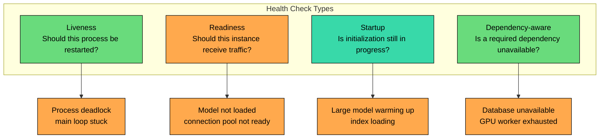


| Check Type | Question | Typical Action |
|------------|----------|----------------|
| **Liveness** | Is the process irrecoverably stuck? | Restart the instance |
| **Readiness** | Can this instance accept new traffic? | Remove from load balancing |
| **Startup** | Is slow initialization still expected? | Delay liveness/readiness decisions |
| **Dependency-aware** | Is a required dependency unavailable? | Degrade, drain, or alert depending on impact |


For AI systems, readiness is especially important. A model-serving pod should not receive traffic just because the HTTP server has started. It may still be loading weights, warming CUDA kernels, downloading adapters, or building a tokenizer cache. Mark it ready only when it can serve the request class it advertises.

#### Health Endpoint Example


```shell
GET /ready

Healthy:
{
  "status": "ready",
  "checks": {
    "model_loaded": true,
    "gpu_available": true,
    "vector_store": "reachable"
  }
}

Not ready:
{
  "status": "not_ready",
  "checks": {
    "model_loaded": false,
    "gpu_available": true,
    "vector_store": "reachable"
  }
}
```


Keep liveness checks shallow. A liveness check that fails because a downstream database is slow can cause a restart storm. Use readiness to remove an instance from traffic; use liveness to restart a process that cannot recover by itself.

#### Push and Pull Checks

**Push-based checks** use heartbeats or lease renewal.


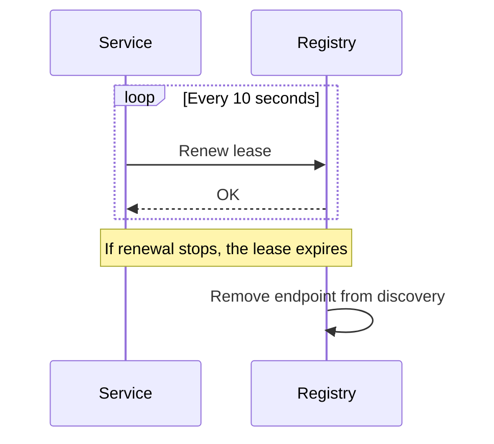


**Pull-based checks** are performed by a registry, load balancer, orchestrator, or proxy.


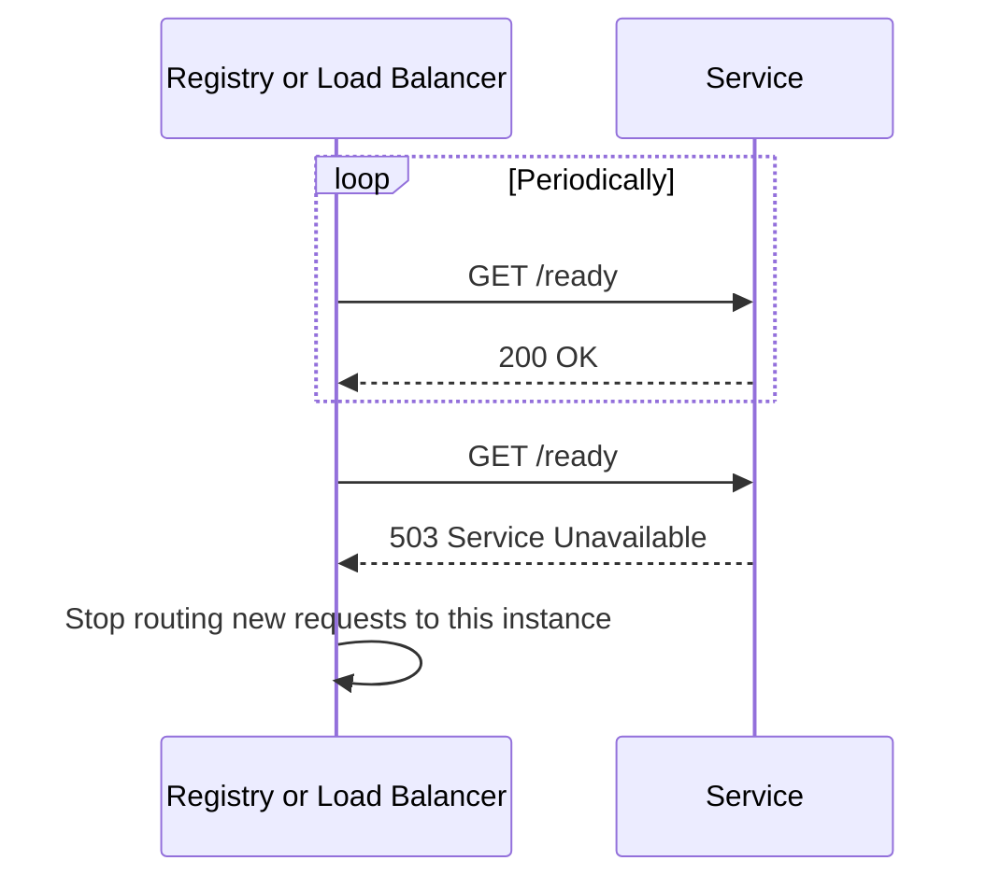


Both styles are used in production. The discovery system must converge quickly enough without flapping during short failures.

---

## Common Implementations

#### Kubernetes

Kubernetes provides discovery through Services, DNS, and EndpointSlices.


```shell
Service DNS name:
<service-name>.<namespace>.svc.cluster.local

Examples:
payment-api.default.svc.cluster.local
embedding-service.production.svc.cluster.local

Headless Service:
<service-name>.<namespace>.svc.cluster.local -> pod IPs
```


Use normal Services when clients should not care which pod handles a request. Use headless Services when the client needs individual pod identities, common with StatefulSets, brokers, databases, and some sharded systems.

#### Consul

Consul is a general-purpose service discovery and service networking platform. It is common in VM-heavy, hybrid, and multi-runtime environments where Kubernetes is not the only scheduler.


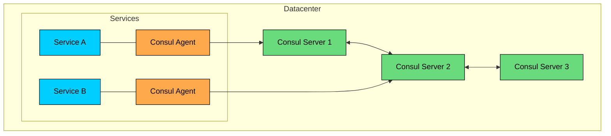


Consul supports discovery through DNS and HTTP APIs, health checks, prepared queries, multi-datacenter operation, and service mesh features. It is a strong fit when services span VMs, containers, multiple clouds, and legacy networks.

#### etcd and ZooKeeper

etcd and ZooKeeper are coordination systems. They can store discovery data, leases, and watches, but application teams should avoid building a bespoke discovery layer on top of them unless they have a clear reason.

etcd is best known as Kubernetes' backing store. ZooKeeper appears in older distributed systems and data infrastructure. Both are useful to understand because they explain how strongly consistent registries, leases, and watches work.

#### Cloud Load Balancers and Cloud Service Discovery

Cloud platforms provide managed discovery and routing through services such as AWS Elastic Load Balancing, AWS Cloud Map, Google Cloud service discovery features, Azure internal load balancers, and managed Kubernetes integrations.

Managed options reduce operational work, but they come with provider-specific behavior, limits, health-check semantics, and pricing. Treat those details as part of the design, not an implementation footnote.

---

## Best Practices

#### 1. Keep Service Names Stable

Names should describe the capability, not the current implementation.


| Better Names | Poor Names |
|--------------|------------|
| `payment-api` | `svc1` |
| `inventory-api` | `my-service` |
| `embedding-service` | `fastapi-new` |
| `reranker-service` | `temp-gpu-service` |


Implementation names age badly. Capabilities age more slowly.

#### 2. Use Metadata Deliberately

Discovery metadata should support routing and operations.


```shell
Service: embedding-service
Instance: 10.0.42.18:8080
Metadata:
  version: 3.4.1
  environment: production
  region: us-east-1
  zone: us-east-1a
  model: text-embedding-3-large
  hardware: gpu-l4
```


Do not let metadata become an ungoverned dumping ground. If routing depends on a key, document its meaning and allowed values.

#### 3. Separate Liveness From Readiness

Use liveness to restart broken processes. Use readiness to control traffic. This distinction prevents many avoidable incidents.

For model-serving workloads, readiness should include model availability, required accelerator state, and any local assets needed to serve the advertised route.

#### 4. Drain Before Shutdown

On shutdown, stop accepting new work, fail readiness, allow the discovery system to remove the instance, then finish in-flight requests.


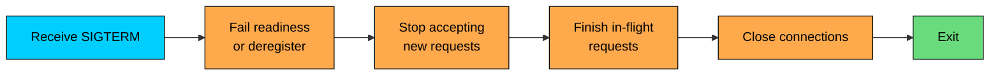


This is especially important for long-running inference, streaming responses, queue consumers, and batch workers.

#### 5. Design for Stale Discovery Data

Discovery data is never perfectly current. Build clients and proxies as if an endpoint can disappear immediately after lookup.

- Use timeouts on every network call.
- Retry only idempotent operations or requests with idempotency keys.
- Apply exponential backoff with jitter.
- Circuit-break repeatedly failing endpoints.
- Re-resolve names after connection failures.

Retries are not a substitute for correctness. Retrying a non-idempotent payment or job submission can create duplicate side effects.

#### 6. Watch DNS and Connection Caching

DNS TTL does not guarantee fast traffic movement if clients hold long-lived connections. HTTP keep-alive, HTTP/2, gRPC, database pools, and SDK-level caches can keep using old endpoints.

For services that need fast failover, tune connection lifetimes, idle timeouts, resolver behavior, and load-balancer health thresholds together.

#### 7. Avoid Thundering Herds

When a registry recovers, thousands of clients may refresh at once.


```shell
Without jitter:
10:00:00 - Registry recovers
10:00:00 - 1000 clients refresh immediately
10:00:01 - Registry is overloaded again

With jitter:
10:00:00 to 10:00:30 - Clients refresh across a randomized window
10:00:30 - Registry has served the fleet without a spike
```


Add jitter to refresh intervals, retries, and reconnect loops.

---

## Summary

Service discovery maps stable service names to healthy, current endpoints.

- Static IP configuration fails when services scale, fail, restart, or move.
- A registry stores service names, endpoints, health state, and routing metadata.
- DNS-based discovery is simple and widely supported, but caching and long-lived connections matter.
- Client-side discovery gives callers more control, but pushes complexity into every client.
- Server-side discovery keeps clients simple and lets infrastructure own routing behavior.
- Modern Kubernetes discovery is built around Services, CoreDNS, and EndpointSlices; avoid older explanations that rely only on kube-dns, Endpoints, or iptables.
- Health checks must distinguish liveness from readiness, especially for slow-starting AI workloads such as model servers.
- Good discovery design assumes stale data, failed endpoints, graceful shutdown, retries with jitter, and clear ownership between application and platform teams.

Service discovery answers "where is the service?" The next design question is usually "who should be allowed to call it, and through which entry point?" That leads naturally to API gateways, ingress, and service-to-service traffic policy.

</section>
