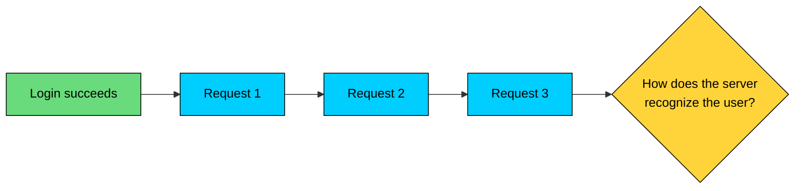
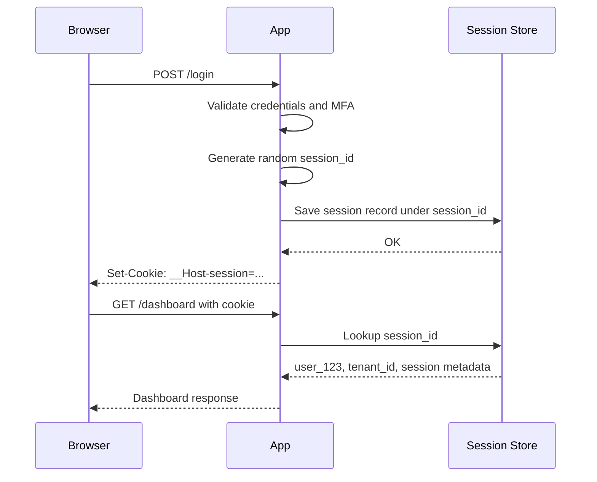
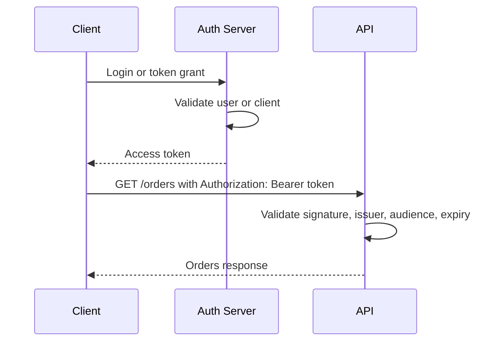
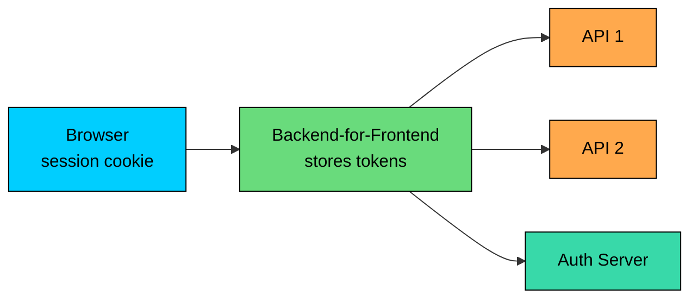

import React from 'react';
import CodeBlock from '../../../../components/ui/CodeBlock';
import Callout from '../../../../components/ui/Callout';

<div className="article-header">
  <div className="breadcrumb">
    <a href="/">Curated Notes</a>
    <span className="breadcrumb-separator">›</span>
    <span className="breadcrumb-current">Session-Based vs Token-Based Authentication</span>
  </div>
  <h1>Session-Based vs Token-Based Authentication</h1>
  <p style={{ color: 'var(--text-muted)', fontSize: '1.1rem', marginBottom: '16px', lineHeight: '1.6' }}>
    Master the essentials of Session-Based vs Token-Based Authentication in this curated guide.
  </p>
  <div className="meta-info">
    <span className="meta-item">
      <svg width="14" height="14" viewBox="0 0 24 24" fill="none" stroke="currentColor" strokeWidth="2"><circle cx="12" cy="12" r="10"/><polyline points="12 6 12 12 16 14"/></svg>
      10 min read
    </span>
    <span className="difficulty-badge difficulty-badge--intermediate">Intermediate</span>
  </div>
</div>

<section className="content-section">

After a user signs in, every later request needs a way to prove it belongs to the same authenticated user.

Two patterns dominate. **Session-based authentication** stores an opaque session ID on the client, usually in a cookie, and keeps the session state on the server. **Token-based authentication** stores a token on the client and presents it on each request. The token may be opaque or self-contained, such as a JWT.

The real question is not "which one scales?" Both can scale. It is **where authentication state lives, and how quickly you can change or revoke it**.

---

## 1. The Core Problem

HTTP is stateless. A server does not automatically know that request 20 belongs to the same user who logged in on request 1.





The system needs a credential that can be presented after login. That credential must identify the authenticated subject, expire, be protected from theft, support logout and revocation when the risk requires it, and work with the client type, whether that is a browser, mobile app, CLI, service, or third-party API client.

Sessions and tokens solve this problem differently.

---

## 2. Session-Based Authentication

In session-based authentication, the server creates a session record and gives the client a random session ID.

The session ID is a reference. The real session data lives on the server.





#### What the Server Stores

A session record commonly includes:


| Field | Purpose |
|-------|---------|
| Session ID hash | Lookup key for the session |
| User ID | Authenticated subject |
| Tenant or account scope | Current organization or workspace |
| Created at | Session creation time |
| Last seen at | Activity tracking and idle timeout |
| Expires at | Absolute timeout |
| MFA state | Whether strong authentication was completed |
| Device metadata | User agent, device ID, approximate location |
| Revoked at | Explicit logout or administrative revocation |


Store a hash of the session ID rather than the raw session ID when practical. If the session store leaks, raw active session IDs are bearer credentials.

#### Cookie Settings

Browser sessions are usually carried in cookies.


```shell
Set-Cookie: __Host-session=<random-value>;
            Path=/;
            Secure;
            HttpOnly;
            SameSite=Lax;
            Max-Age=3600
```


Important attributes:


| Attribute | Why it matters |
|-----------|----------------|
| `Secure` | Sends the cookie only over HTTPS |
| `HttpOnly` | Prevents JavaScript from reading the cookie |
| `SameSite` | Reduces CSRF risk for cross-site requests |
| `Path=/` | Required for the `__Host-` prefix |
| `__Host-` prefix | Prevents Domain scoping and requires Secure + Path=/ |
| `Max-Age` / `Expires` | Controls cookie lifetime |


`SameSite=Lax` is often a practical default for web apps. `Strict` is stronger but can break legitimate cross-site navigation flows. Sensitive state-changing requests should still use CSRF protection, such as synchronizer tokens or a well-designed double-submit pattern.

#### Scaling Sessions

Sessions are stateful, but stateful does not mean unscalable.

Common designs:


| Design | How it works | Tradeoff |
|--------|--------------|----------|
| Single server memory | Session lives in application memory | Simple, not resilient |
| Sticky sessions | Load balancer keeps user on the same server | Failover and rebalancing are harder |
| Shared store | All servers use Redis, Memcached, or a database | Extra dependency and network hop |
| Replicated store | Session data is replicated across nodes | More operational complexity |


For most production web apps, a shared store such as Redis is straightforward and fast enough. The session lookup is usually not the bottleneck. Poor database queries, external APIs, template rendering, and over-fetching are more often the real cost.

#### Strengths

Sessions support immediate logout and administrative revocation, easy active-session management across devices, and a small client credential. The server can update session state without issuing a new client token, and the browser story is strong with `HttpOnly`, `Secure`, and `SameSite` cookies.

#### Weaknesses

The main costs are operational. Sessions require server-side storage, CSRF protection when cookies are sent automatically, and a shared session store that adds an infrastructure dependency. Cross-domain applications also need careful cookie and CORS design.

---

## 3. Token-Based Authentication

In token-based authentication, the client presents a token with each request.

Tokens come in two broad forms:

- **Opaque tokens:** random strings that the server or authorization server looks up.
- **Self-contained tokens:** signed tokens, usually JWTs, that carry claims inside the token.

This distinction matters. Not every token is a JWT, and not every token system is stateless.

#### Self-Contained Token Flow





The API can validate the token without a session lookup if it has the issuer's public key or shared secret. That is useful in distributed systems, but it shifts complexity to token lifetime, key rotation, claim design, and revocation.

#### JWT Basics

A JWT has three Base64Url-encoded parts:


```shell
header.payload.signature
```


The payload is encoded, not encrypted. Anyone holding the token can decode the claims.

Common claims:


| Claim | Meaning |
|-------|---------|
| `sub` | Subject, usually user or client ID |
| `iss` | Issuer |
| `aud` | Intended audience |
| `exp` | Expiration time |
| `nbf` | Not valid before |
| `iat` | Issued at |
| `jti` | Token identifier |


APIs must validate more than the signature. They should validate issuer, audience, expiration, algorithm, key ID, and any required scopes or permissions.

#### Access Tokens and Refresh Tokens

Production token systems often use two token types:


| Token | Lifetime | Purpose |
|-------|----------|---------|
| Access token | Short | Sent to APIs |
| Refresh token | Longer | Used to obtain new access tokens |


Access tokens should be short-lived because they are bearer credentials. If stolen, anyone holding the token can use it until it expires or is revoked.

Refresh tokens need stronger protection. For browser apps, many teams store refresh tokens in `HttpOnly`, `Secure`, `SameSite` cookies and keep access tokens in memory. For mobile apps, use platform secure storage. For backend services, use managed workload identity or a secret manager rather than hardcoded long-lived tokens.

#### Token Storage in Browsers

Browser storage is one of the most misunderstood parts of token-based authentication.


| Storage | Main risk | Notes |
|---------|-----------|-------|
| JavaScript memory | Lost on refresh | Safer against token theft from persistent storage, but still vulnerable to active XSS |
| `localStorage` | Token theft through XSS | Persistent and readable by JavaScript |
| `sessionStorage` | Token theft through XSS | Cleared when the tab closes, still readable by JavaScript |
| `HttpOnly` cookie | CSRF if not protected | Not readable by JavaScript, but sent automatically |
| Backend-for-Frontend session | Server stores tokens; browser stores only a session cookie | Often the safest pattern for browser-based apps |


Do not treat `localStorage` as a safe default for sensitive browser tokens. It is convenient, but an XSS bug can read and exfiltrate the token.

For many browser apps, the best design is still cookie-based: either a traditional server-side session or a Backend-for-Frontend that keeps OAuth tokens on the server and gives the browser only an `HttpOnly` session cookie.

#### Strengths

Tokens work well for APIs, mobile apps, CLIs, and service-to-service calls. Self-contained tokens reduce central lookup on every API call and can carry audience, scope, and expiration in a standard format. They fit OAuth 2.0 and OpenID Connect cleanly, which makes them useful when many services need to validate the same credential.

#### Weaknesses

Revocation is harder for self-contained tokens, and stale claims remain valid until expiration unless extra checks exist. Large tokens increase request size, key rotation and issuer/audience validation must be correct, and browser storage choices create XSS or CSRF tradeoffs.

---

## 4. The Real Tradeoffs

The old framing is "sessions are stateful, tokens are stateless." That is true but incomplete.

The real tradeoffs are operational.


| Concern | Session-based | Token-based |
|---------|---------------|-------------|
| Server-side state | Required | Optional, depending on token type |
| Logout and revocation | Direct | Easy for opaque tokens, harder for self-contained tokens |
| Browser safety | Strong with `HttpOnly` cookies | Depends heavily on storage design |
| CSRF | Relevant for cookies | Relevant if tokens are stored in cookies |
| XSS token theft | Reduced by `HttpOnly` cookies | High if tokens are readable by JavaScript |
| API/service use | Possible, but less common | Natural fit |
| Claim freshness | Server can check current state | Claims may be stale until token refresh |
| Request size | Small cookie | JWTs can be large |
| Operational dependency | Session store | Token issuer, keys, revocation strategy |


#### Revocation

Sessions are easy to revoke: delete or mark the session as revoked.

Self-contained access tokens are harder. If an access token is valid for 30 minutes, removing a user's role may not affect that token until it expires.

Common mitigations:

- Short access token lifetime.
- Refresh token rotation.
- Revocation list for high-risk tokens.
- Permission version claim checked server-side.
- Token introspection for sensitive APIs.
- Step-up authentication for dangerous actions.

#### Freshness of Authorization

Putting roles and permissions in a JWT avoids a lookup, but it can make authorization stale.

If a user loses `billing_admin`, an old token may still contain that role. For low-risk reads, a short delay may be acceptable. For production access, payments, security settings, or user management, check current authorization server-side or use short token lifetimes.

#### Performance

Session lookup versus token verification is rarely the deciding factor.

A Redis lookup may add a small network hop. JWT verification uses CPU and may require key lookup or JWKS caching. Large JWTs also increase bandwidth on every request.

Choose based on correctness, revocation, client type, and operational simplicity before optimizing for a few milliseconds.

---

## 5. When to Use Sessions

Use session-based authentication when:

- You are building a browser-first web application.
- You want simple logout and revocation.
- You need active-session management across devices.
- You want the browser to store only an opaque reference.
- Your app can use first-party cookies.
- You want to avoid exposing tokens to JavaScript.

Sessions are a strong default for traditional web apps and many modern SaaS apps. They are not old-fashioned. A well-designed Redis-backed session system is easy to reason about and scales well.

---

## 6. When to Use Tokens

Use token-based authentication when:

- You are building public APIs for third-party clients.
- You have mobile apps, CLIs, or desktop clients.
- You need OAuth 2.0 delegated access.
- Multiple services need to validate a credential independently.
- You are doing service-to-service authentication.
- You want short-lived access tokens with scoped permissions.

Prefer short-lived access tokens. Keep refresh tokens protected and revocable. For service-to-service auth, prefer platform identity such as cloud IAM, workload identity, mTLS, or SPIFFE-style identities over manually distributed long-lived bearer tokens.

---

## 7. Hybrid Patterns

Many production systems use both.

#### Browser App + Backend-for-Frontend

The browser stores an `HttpOnly` session cookie. The Backend-for-Frontend stores access and refresh tokens server-side and calls downstream APIs.





This keeps sensitive tokens out of JavaScript while still using token-based authentication between backend components.

#### Short-Lived Access Token + Refresh Session

The client receives a short-lived access token and uses a protected refresh mechanism to obtain new tokens.

This pattern limits the damage of access token theft while keeping API calls efficient.

#### Opaque Tokens + Introspection

The API receives an opaque token and asks the authorization server whether it is active.

This improves revocation and claim freshness, but adds a network call unless results are cached.

---

## 8. Security Checklist

For sessions:

- Generate high-entropy random session IDs.
- Store only a hash of the session ID when practical.
- Use `Secure`, `HttpOnly`, and `SameSite` cookies.
- Rotate session IDs after login and privilege changes.
- Enforce idle and absolute timeouts.
- Protect state-changing requests from CSRF.
- Revoke sessions on logout, password reset, MFA reset, and account disablement.

For tokens:

- Use short-lived access tokens.
- Validate issuer, audience, expiration, signature, algorithm, and key ID.
- Rotate signing keys safely.
- Keep sensitive data out of token payloads.
- Avoid long-lived bearer tokens.
- Protect refresh tokens more strongly than access tokens.
- Plan revocation before launch.
- Do not store sensitive browser tokens in `localStorage` by default.

For both:

- Use HTTPS everywhere.
- Log authentication and revocation events.
- Rate limit login and token endpoints.
- Require step-up authentication for sensitive actions.
- Treat internal service calls as authenticated and authorized requests.

---

## 9. Key Takeaways

Session-based authentication stores state on the server and gives the client an opaque reference. It is a strong default for browser applications because revocation is simple and cookies can be protected from JavaScript.

Token-based authentication gives clients a credential they present to APIs. It is a strong fit for APIs, mobile apps, CLIs, service-to-service calls, and OAuth/OIDC systems, but it requires careful handling of storage, expiration, key rotation, and revocation.

Do not choose tokens because they sound more scalable. Choose based on the client, threat model, revocation requirements, and authorization freshness. In many production systems, the best answer is a hybrid: browser sessions at the edge, short-lived tokens behind the edge.

---

## Quiz

</section>
