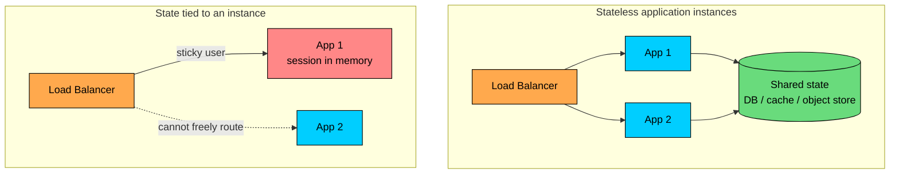
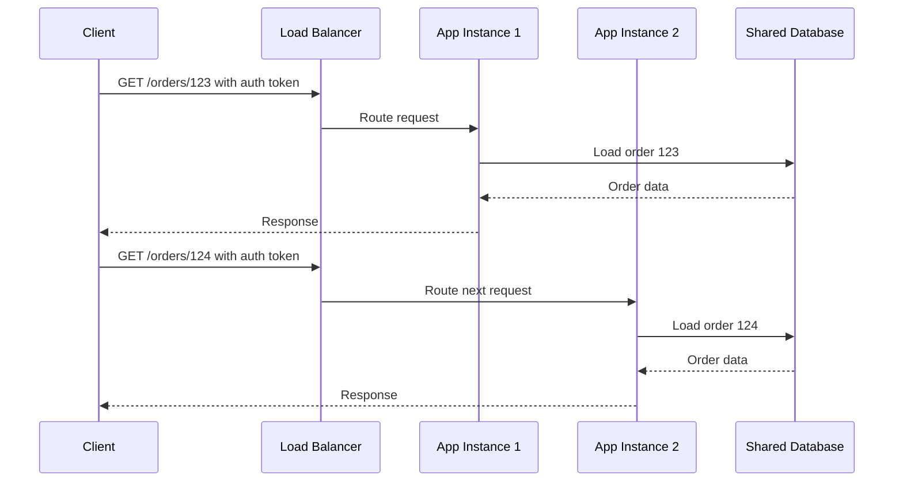
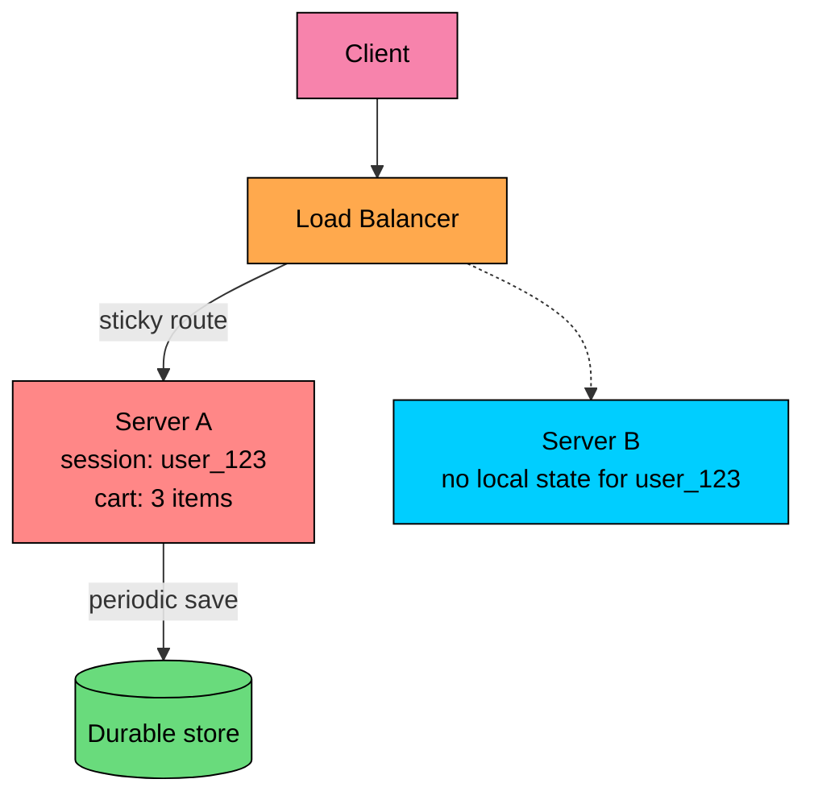
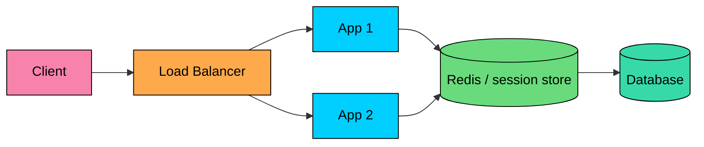
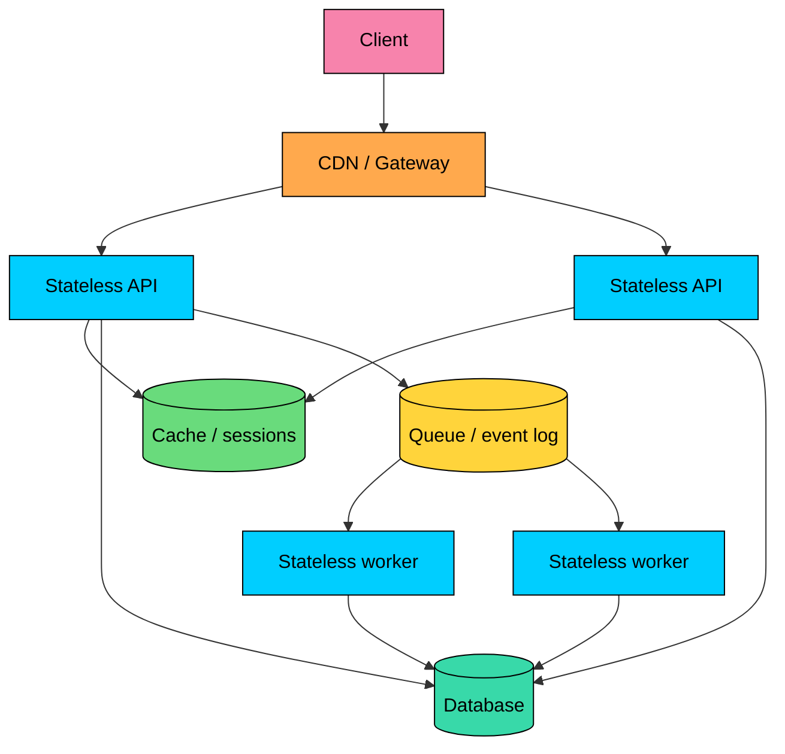

import React from 'react';
import CodeBlock from '../../../../components/ui/CodeBlock';
import Callout from '../../../../components/ui/Callout';

<div className="article-header">
  <div className="breadcrumb">
    <a href="/">Curated Notes</a>
    <span className="breadcrumb-separator">›</span>
    <span className="breadcrumb-current">Stateful vs Stateless Architecture</span>
  </div>
  <h1>Stateful vs Stateless Architecture</h1>
  <p style={{ color: 'var(--text-muted)', fontSize: '1.1rem', marginBottom: '16px', lineHeight: '1.6' }}>
    Master the essentials of Stateful vs Stateless Architecture in this curated guide.
  </p>
  <div className="meta-info">
    <span className="meta-item">
      <svg width="14" height="14" viewBox="0 0 24 24" fill="none" stroke="currentColor" strokeWidth="2"><circle cx="12" cy="12" r="10"/><polyline points="12 6 12 12 16 14"/></svg>
      10 min read
    </span>
    <span className="difficulty-badge difficulty-badge--intermediate">Intermediate</span>
  </div>
</div>

<section className="content-section">

Every useful system has state somewhere: accounts, orders, carts, files, conversations, model outputs, workflow progress, locks, and database rows. The architectural question is where that state lives.

A **stateless service** keeps no required per-client state inside any single application instance, so any instance can handle the next request because durable state lives elsewhere.

A **stateful service** keeps state that affects future requests, either locally in the process or in a tightly coupled state store.





Neither is universally better. Stateless services are easier to scale and replace. Stateful systems offer continuity, locality, and tighter control over long-lived workflows. Most production architectures use both.

---

## 1. What Counts as State?

State is any information that must survive beyond one function call or one request.

That includes user authentication sessions, shopping carts and checkout progress, uploaded files, WebSocket connection membership, and game room state.

It also includes distributed locks and leases, job progress and workflow state, database transactions, conversation history in an AI assistant, and vector indexes, caches, and model-serving warm state.

State can live in several different places, and each location comes with its own trade-offs.

State on the **client**, such as a JWT, a local draft, or a cached feed, reduces server storage but can be lost, stale, or tampered with.

State in **application memory**, like an in-memory session, a game room, or a WebSocket connection map, is fast but tied to one process unless it is replicated.

A **shared cache** such as Redis can hold session data, rate-limit counters, or presence information for fast shared access, at the cost of an external dependency.

A **database** holds durable, queryable records like orders, accounts, and workflow state, but reads and writes are slower than memory.

**Object storage** is durable and cheap for large data such as uploads, generated reports, or model artifacts, though it is not ideal for small hot mutations.

An **event log** like a Kafka topic, audit stream, or change history is replayable, but it requires consumers and careful ordering design.

The design question is not "state or no state?" It is **where should state live, who owns it, and what happens when that owner fails?**

---

## 2. Stateless Architecture

In a stateless architecture, each request carries enough information for the server to process it, or the server can fetch required state from shared infrastructure.

The application instance does not rely on memory from a previous request.





Both requests can go to different app instances because neither instance needs private session memory.

#### Common Stateless Patterns

#### Token-Based Requests

The client sends a credential such as an access token on each request:


```shell
Authorization: Bearer <access-token>
```


The server validates the token and processes the request.

If the token is a self-contained JWT, the server may validate it without a session lookup. If the token is opaque, the server or gateway still needs a lookup or introspection call.

JWTs are not automatically better. They reduce lookup cost in some designs, but they make revocation, claim freshness, key rotation, and token storage more important.

#### Externalized State

Application servers stay stateless by moving state into shared systems.

Sessions go into Redis, files go into object storage, and user data goes into a database.

Long-running jobs go into a queue or workflow engine, search data goes into a search index, and conversation history goes into a database or a dedicated memory store.

The app instance can be replaced at any time because it is not the only place that knows what is happening.

#### Idempotent APIs

Stateless services often pair well with idempotent operations.

For example, a retry of this request should not create duplicate users:


```plaintext
PUT /users/123
```


Idempotency is especially important when clients, gateways, or queues retry after timeouts. Stateless request handling does not remove the need to protect writes from duplication.

#### Advantages of Stateless Services

Stateless services scale horizontally without much effort, because any instance can handle any request. Failover is simple, since traffic can move to another instance when one dies.

Deployments are safer too, as rolling restarts and autoscaling do not put critical local state at risk.

Load balancing is straightforward because the load balancer does not need to keep one user pinned to one server, and recovery is cleaner because durable state lives in systems designed for persistence.

#### Trade-offs of Stateless Services

The trade-offs come from pushing state outward. Every request may need database, cache, token, or object-store access, so shared dependencies see more traffic.

Request context grows larger, since tokens, headers, and payloads must carry more information. Personalization is harder without storage somewhere, because user-specific behavior still depends on state.

Long-lived bearer tokens introduce their own risks, as they are dangerous if stolen and hard to revoke if they are fully self-contained.

External state also becomes critical, since a stateless app tier can still fail if the shared database, cache, or identity provider is unavailable.

Stateless application servers are a strong default for APIs, web backends, serverless functions, and worker fleets. They are not a substitute for good data design.

---

## 3. Stateful Architecture

In a stateful architecture, a component remembers information that affects future interactions.

That state may be local to a process, stored on disk, replicated across peers, or held in a database tightly coupled to the service. The key point is that the component has continuity.

Stateful does not mean poorly designed. Databases, caches, queues, stream processors, workflow engines, game servers, and WebSocket gateways are stateful by nature.





If the next request must return to `Server A`, the service is harder to scale and fail over. If `Server A` dies before saving the state, the user may lose work.

#### Common Stateful Patterns

#### Sticky Sessions

Sticky sessions route the same user to the same server.

This can work for small systems or low-risk state, but it creates operational friction.

A hot user or tenant can overload one instance, removing an instance can disrupt active users, rebalancing traffic becomes harder, and local session loss can force users to log in again.

Sticky sessions are sometimes acceptable as a transitional design, but they should not be the first choice for high-availability systems.

#### Shared Session Store

A better web-session design stores session data in a shared store such as Redis or a database.





The app tier becomes mostly stateless, while the session store owns the state. This improves load balancing and failover, but it adds a dependency that must be monitored, scaled, backed up when needed, and protected from overload.

#### Stateful Workers and Workflow Engines

Some workflows need durable progress. Payment authorization and capture, order fulfillment, loan approval, data import pipelines, and AI agent runs with tool calls and intermediate results all need to survive worker restarts and partial failures.

For these, state should usually live in a durable workflow system, database, or event log, not in one worker's memory.

Workers can still be stateless executors while the workflow engine is stateful.

#### Stateful Connections

WebSockets, multiplayer sessions, and collaborative editing often keep connection state.

The gateway has to remember which socket belongs to which user, which room or document the user joined, the last heartbeat, delivery acknowledgments, and presence and cursor position.

The connection gateway may be stateful, but durable application state should still be stored elsewhere. A WebSocket connection is not a database.

#### Advantages of Stateful Systems

Stateful systems provide continuity, preserving context across many interactions.

They lower repeated lookup cost by keeping frequently used context close to the computation, which makes them a better fit for long-running interactions such as games, collaboration, workflow orchestration, and streaming sessions.

They also enable stronger coordination, since locks, leases, leader election, and transactions are inherently stateful, and they support efficient local processing in systems that benefit from keeping hot state in memory.

#### Trade-offs of Stateful Systems

The cost of statefulness shows up across scaling, failover, and operations. State must be partitioned, replicated, moved, or shared, which makes scaling harder.

Failover is harder too, because a replacement node must recover or reconstruct the state it inherits. Backups, replication, consistency, rebalancing, and recovery become central concerns, so operational complexity grows.

Popular users, tenants, rooms, partitions, or keys can overload the state owner and create hotspots.

Deployments need more care, since restarting nodes can interrupt active sessions unless state is externalized or drained safely.

Stateful architecture is not a flaw. It is a responsibility.

---

## 4. Stateful vs Stateless by Component

A system can be stateless at one layer and stateful at another.


| Component | Usually Stateless? | Why |
|-----------|--------------------|-----|
| API application server | Yes | Easier to scale, restart, and load balance |
| Serverless function | Yes | Instances are short-lived and should not own durable state |
| Database | No | Its purpose is to store durable state |
| Cache | No | It stores shared hot data, sessions, counters, or derived state |
| Message broker | No | It tracks messages, offsets, acknowledgments, and backlog |
| WebSocket gateway | Partly | It owns live connections, but durable state should live elsewhere |
| Workflow engine | No | It tracks long-running process state |
| AI inference worker | Often stateless | Model weights are loaded locally, but request/session state should usually be external |


This is how most mature systems are designed: stateless compute around stateful data systems.

The stateless tier gives elasticity. The stateful tier gives durability, ordering, coordination, and recovery.

---

## 5. Authentication: Sessions vs Tokens

Authentication is where many stateful/stateless discussions become confused.

Session-based authentication is usually stateful:

1. The server creates a session record.
2. The browser stores an opaque session ID in a secure cookie.
3. Each request includes the cookie.
4. The server looks up the session.

Token-based authentication can be stateless, but not always. A self-contained JWT can be validated without a lookup.

An opaque token requires lookup or introspection. A JWT paired with a revocation list, an allowlist, or a server-side session check is no longer fully stateless either.


| Approach | Where Auth State Lives | Strength | Risk |
|----------|------------------------|----------|------|
| Server session | Server-side session store | Easy revocation and logout | Requires session storage |
| Opaque token | Authorization server or token store | Central control | Lookup required |
| Self-contained JWT | Token claims and signing key | No lookup on every request | Revocation and stale claims are harder |


Do not choose JWTs only because they sound scalable. A Redis-backed session store can handle very high traffic and gives cleaner logout and revocation.

JWTs are useful, but they require careful lifetime, audience, issuer, key rotation, and storage design.

---

## 6. Choosing the Right Approach

Stateless application servers are the right choice when you need horizontal scaling and want any instance to handle any request, or when requests are independent and the server can fetch required data from shared systems.

They also fit when you deploy frequently and rolling restarts cannot disrupt user state, when you run on serverless or containers where instances are created and destroyed often, or when you want simple load balancing without sticky routing.

Stateful components make sense when the system must preserve durable facts, which is exactly what databases, queues, logs, and object stores are designed for.

They also fit long-running workflows such as checkout, payments, imports, and AI agent runs that need recoverable progress.

Low-latency local context is another good reason, since games, collaboration rooms, and interactive sessions may keep hot state in memory.

Coordination primitives like locks, transactions, leases, and leader election are inherently stateful. User experience often depends on continuity too, since drafts, carts, sessions, and conversation history should survive reconnects.

The best architecture often looks like this:





Stateless services handle compute. Stateful systems own durable state.

---

## 7. Practical Rules

A few rules tend to hold up well when designing a service. Keep application instances replaceable, so that a restart never loses important user or business state.

Store durable state in systems built for durability, such as databases, queues, logs, object stores, or workflow engines.

Avoid sticky sessions unless you have a clear reason, because they make scaling and failover harder.

Use shared session stores for web sessions that need revocation, since stateless tokens are not always the safest choice.

Design for retries, so stateless request handlers still use idempotency keys or safe write patterns.

Plan state migration, because stateful systems need backup, restore, replication, rebalancing, and schema evolution.

Separate live connection state from durable product state, since a WebSocket gateway may know who is connected, but the database should own messages, documents, and permissions.

The practical goal is not to make everything stateless. That is impossible.

The goal is to keep compute replaceable and put important state in the right place.

</section>
