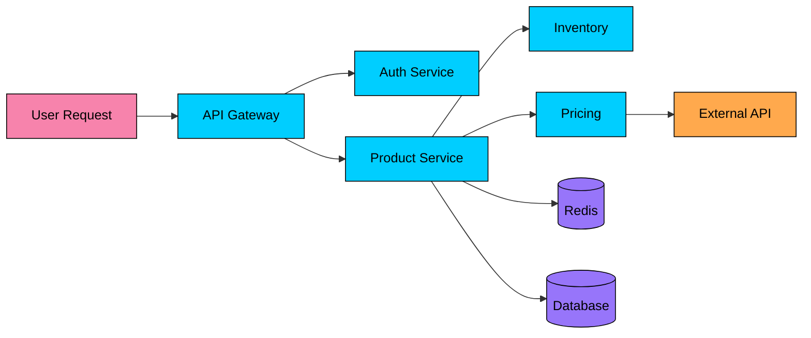
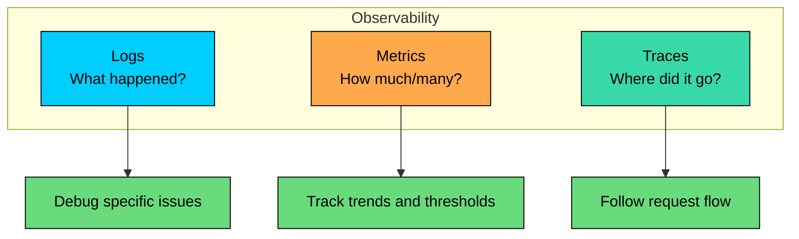
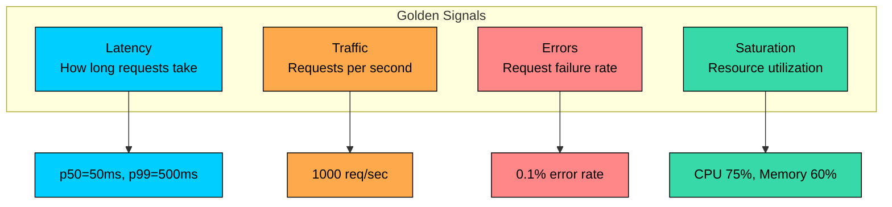
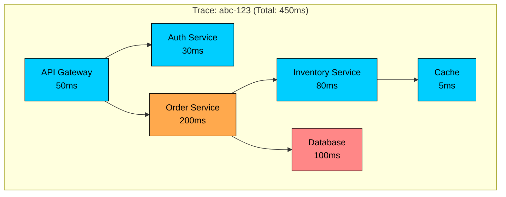
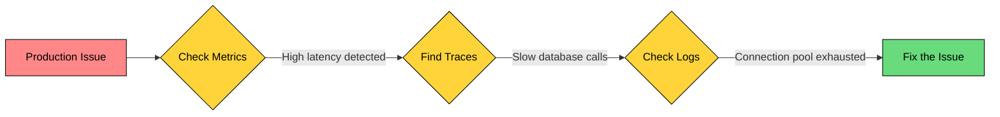
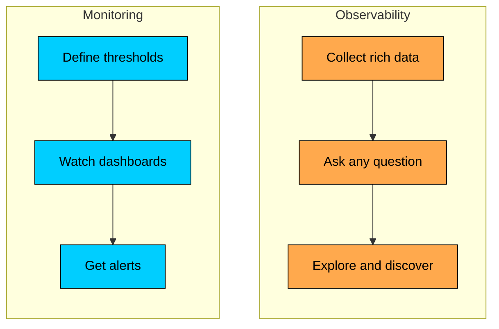
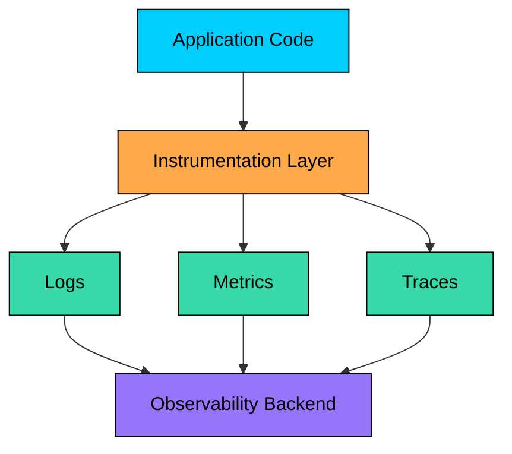

import React from 'react';
import CodeBlock from '../../../../components/ui/CodeBlock';
import Callout from '../../../../components/ui/Callout';

<div className="article-header">
  <div className="breadcrumb">
    <a href="/">Curated Notes</a>
    <span className="breadcrumb-separator">›</span>
    <span className="breadcrumb-current">Three Pillars of Observability</span>
  </div>
  <h1>Three Pillars of Observability</h1>
  <p style={{ color: 'var(--text-muted)', fontSize: '1.1rem', marginBottom: '16px', lineHeight: '1.6' }}>
    Master the essentials of Three Pillars of Observability in this curated guide.
  </p>
  <div className="meta-info">
    <span className="meta-item">
      <svg width="14" height="14" viewBox="0 0 24 24" fill="none" stroke="currentColor" strokeWidth="2"><circle cx="12" cy="12" r="10"/><polyline points="12 6 12 12 16 14"/></svg>
      10 min read
    </span>
    <span className="difficulty-badge difficulty-badge--intermediate">Intermediate</span>
  </div>
</div>

<section className="content-section">

Observability is the ability to understand what is happening inside a system by examining its outputs. It helps teams answer why a system is behaving a certain way, not only whether it is up.

In distributed systems, one request can cross many services, databases, queues, caches, and third-party dependencies. Logs, metrics, and traces give engineers different views of that behavior.

In this chapter, you will learn how logs, metrics, and traces work together to explain system behavior, especially when monitoring alone is not enough.

---

## Why Observability Matters

In a monolithic application, debugging is relatively straightforward. You have one process, one log file, and one stack trace when something goes wrong. You can step through code with a debugger and reproduce issues locally.

Distributed systems change everything. A single user request might touch dozens of services, each running on different machines, each with its own logs and failure modes. The problem might be in any of them, or in the network between them, or in the interaction between services that individually work fine.





When latency spikes in this system, where do you look first? Is it the database? The external API? Network congestion between services? A slow cache lookup? 

Without observability, finding the answer requires guesswork and luck.

#### The Debugging Challenge

Traditional debugging approaches fail in distributed systems. Debuggers are useful in local development but not across production services, print statements collapse under high-volume traffic, local log files stop helping once work spans many servers, and reproducing locally rarely captures race conditions, network behavior, or load-dependent bugs.

Observability tools fill this gap. They collect and correlate data from across your entire system, making it possible to ask why a specific request took 5 seconds, which service is causing an error-rate increase, or what changed between a healthy period and a broken one.

---

## The Three Pillars

Observability rests on three pillars: **logs**, **metrics**, and **traces**. Each one answers a different kind of question, and together they give you a clear, end-to-end view of what’s happening inside your system.





**Logs** give you detailed, time-ordered records that help you debug specific issues.

**Metrics** give you aggregated numbers that help you track trends, set thresholds, and catch problems early.

**Traces** give you a request’s journey across services, showing the full flow and where time is spent.

A simple way to remember them is to think of a doctor’s toolkit: logs are clinical notes, metrics are vital signs, and traces are scans that reveal paths and connections.

---

## Pillar 1: Logs

Logs are timestamped records of discrete events in your system. Whenever something meaningful happens, your code writes a log entry that describes it.

#### What Logs Look Like


```shell
2024-01-15T10:23:45.123Z INFO  [order-service] Order created: order_id=12345 user_id=789 total=$99.50
2024-01-15T10:23:45.456Z INFO  [payment-service] Payment processed: order_id=12345 method=credit_card status=success
2024-01-15T10:23:45.789Z ERROR [inventory-service] Stock check failed: product_id=456 error="connection timeout"
2024-01-15T10:23:46.012Z WARN  [order-service] Retrying inventory check: order_id=12345 attempt=2
```


Each entry typically captures when the event happened, where it happened, what occurred, and enough searchable context, such as `order_id`, `user_id`, or error details.

#### Structured vs Unstructured Logs

Modern systems prefer **structured logs** (usually JSON) over plain text because structured logs are easier to parse, index, and query.

#### Unstructured (hard to parse reliably)


```shell
Order 12345 created for user 789, total $99.50
```


#### Structured (machine-readable)


```json
{
  "timestamp": "2024-01-15T10:23:45.123Z",
  "level": "INFO",
  "service.name": "order-service",
  "event.name": "order_created",
  "order_id": "12345",
  "user_id": "789",
  "total": 99.50,
  "currency": "USD"
}
```


With structured logs, queries become straightforward: show all **ERROR** logs from `payment-service` in the last hour, find failed orders over `$1000`, or count events by type per service.

#### What Logs Are Good For

Logs are especially useful for debugging errors, preserving audit trails, investigating security events, and understanding why a specific decision was made.

#### Limitations of Logs

Logs are essential, but they do not scale gracefully on their own. High-traffic systems can produce billions of lines per day, storage and indexing get expensive, useful entries get buried in noise, logs describe individual events rather than trends, and one service’s log rarely explains the whole distributed request.

This is why logs alone are not enough. Next, we’ll use **metrics** to zoom out and understand the system’s overall health and trends.

---

## Pillar 2: Metrics

Metrics are numerical measurements collected over time. While logs capture individual events, metrics aggregate those events into **time series** so you can spot trends, compare behavior over time, and detect issues early.

#### What Metrics Look Like


```shell
## Counter: Total number of requests
http_requests_total{service="api", method="GET", status="200"} 1523847

## Gauge: Current value that can go up or down
active_connections{service="database"} 47

## Histogram: Distribution of values
request_duration_seconds_bucket{le="0.1"} 14523
request_duration_seconds_bucket{le="0.5"} 18456
request_duration_seconds_bucket{le="1.0"} 19234
```


#### Types of Metrics

Metrics generally fall into a few common types:

#### Counters

Counters track totals that only go up, such as requests served, errors occurred, or bytes transferred.

#### **Gauges**

Gauges track current values that can go up or down, such as active connections, queue depth, or memory usage.

#### **Histograms**

Histograms track distributions by bucket, such as request latency, request size, or processing duration.

Here’s a quick summary:


| Type | Description | Example | Operations |
|------|-------------|---------|------------|
| **Counter** | Monotonically increasing value | Total requests, errors, bytes | Rate, increase |
| **Gauge** | Current value that can go up or down | Memory usage, queue size, temperature | Current, min, max, avg |
| **Histogram** | Distribution of observations | Request latency, response size | Percentiles, averages |
| **Summary** | Like histogram but with pre-calculated percentiles | Same use cases, lower storage | p50, p95, p99 |


#### The Four Golden Signals

If you track nothing else, track these four. They cover the most important ways services fail or degrade.





Latency shows how long requests take, traffic shows demand, errors show failure rate, and saturation shows how full constrained resources are.

They quickly tell you whether your service is healthy and whether it is trending toward trouble.

#### What Metrics Are Good For

Metrics are useful for alerting, capacity planning, SLA tracking, anomaly detection, and dashboard visualization because they turn many events into trends that can be graphed and compared.

#### Limitations of Metrics

Metrics are powerful, but they have blind spots. Aggregation hides details, high-cardinality labels can make the backend unmanageable, error spikes do not reveal which users were affected, and you can only query metrics you decided to collect in advance.

Metrics usually tell you *that* something is wrong. To find *where* it went wrong in a distributed system, you need **traces**.

---

## Pillar 3: Traces

Traces follow a single request as it moves through your distributed system. They show which services were called, in what order, and how long each step took. If metrics tell you *something* is wrong, traces help you find *where* it went wrong.

#### What Traces Look Like





A trace is made up of **spans**. Each span represents a unit of work, like a service call, a database query, or a cache lookup.


```shell
Trace ID: abc-123
├── Span: API Gateway (0-50ms)
│   ├── Span: Auth Service (5-35ms)
│   └── Span: Order Service (50-250ms)
│       ├── Span: Inventory Service (60-140ms)
│       │   └── Span: Cache Lookup (65-70ms)
│       └── Span: Database Query (150-250ms)  ← SLOW!
```


#### What a span typically includes

A span usually includes a trace ID, span ID, parent span ID, operation name, start and end time, and key-value attributes that describe the work.

#### What Traces Are Good For

Traces are useful for finding bottlenecks, understanding service dependencies, debugging specific requests, identifying cascading failures, and optimizing critical paths.

#### Limitations of Traces

Traces are powerful, but they come with practical constraints. Most systems sample because storing every trace is expensive, every service must propagate trace context, traces cost more to retain than metrics, and large traces with hundreds of spans can be hard to analyze.

---

## How the Pillars Work Together

The real power of observability comes from combining **metrics, traces, and logs**. Each pillar answers a different question, and together they take you from “something feels wrong” to a concrete root cause.





#### A practical debugging workflow

Imagine users report slow checkout. Metrics tell you there is a problem: the dashboard shows p99 latency spiking from 500ms to 5s and error rate increasing from 0.1% to 2%. Traces tell you where the problem is: slow traces show Payment Service taking 4s instead of 100ms because an external API is timing out. Logs tell you why: Payment Service logs show "Connection to payment gateway refused: max retries exceeded," pointing to a payment gateway outage.

Without all three, you end up guessing. With all three, you can move quickly and confidently from symptom to cause.

---

## Monitoring vs Observability

These terms are often used interchangeably, but they represent different philosophies.

**Monitoring** is about watching for *known* problems. You decide ahead of time what to measure, set thresholds, and alert when something crosses the line. This works well for predictable failure modes.

**Observability** is about investigating *unknown* problems. You collect enough high-quality signals (logs, metrics, traces, plus useful context) so you can ask new questions when something unexpected happens. This is what helps in complex distributed systems where failures do not follow a script.





#### Quick comparison


| Monitoring | Observability |
|------------|---------------|
| Answers known questions | Answers unknown questions |
| Predefined alerts | Ad-hoc queries |
| "Is the server up?" | "Why is this user's request slow?" |
| Dashboards | Exploration tools |
| Reactive | Proactive and reactive |


In practice, you need both. Monitoring catches the issues you can predict. Observability helps you debug the ones you cannot.

---

## Building an Observable System

Observability does not happen by accident. You have to design for it from day one, just like scalability or reliability.

#### 1. Instrument Everything

Every service should emit **logs, metrics, and traces** as a first-class part of the codebase.





#### 2. Use Consistent Standards

Observability breaks down quickly when every team does things differently. Standardize logs around consistent JSON fields, metrics around clear names and bounded labels, and traces around stable span attributes plus context propagation standards such as **W3C Trace Context**.

#### 3. Connect the Pillars

The pillars are most useful when you can move between them quickly. Include **trace IDs** in log entries and attach **exemplars** to metric points when possible.

This lets you jump from a metric spike to the exact traces behind it, then to the logs for the failing span.

#### 4. Design for Debuggability

A good rule of thumb is simple: *If this breaks during an incident, what will I need to know to fix it?*

Then make sure the system captures that information by default, not as an afterthought.

---

## Summary

Observability is about understanding what is happening inside your system. Logs record discrete events with full context, metrics aggregate behavior into time series, and traces follow requests through distributed systems.

Each pillar answers a different question. Metrics help you notice that something is wrong, traces help you locate where it went wrong, and logs help explain why it happened.

The pillars work best together. A typical debugging flow starts with metrics detecting an anomaly, traces locating the problem, and logs revealing the root cause.

With the fundamentals established, we will now dive deeper into each pillar. The next chapter focuses on logging, the most familiar pillar but one that is often implemented poorly. We will cover how to write useful logs, choose the right level, structure log data, and avoid common mistakes that make logs useless when you need them most.

</section>
